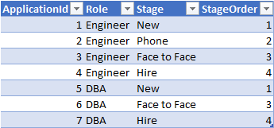
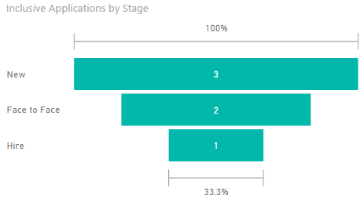
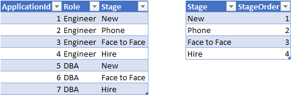
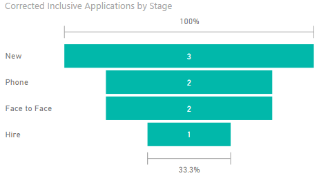

In a [previous post](/blog/2017/09/creating-recruitment-funnel-metrics-in-power-bi) we built a simple set of recruitment funnel metrics that allowed us to plot the hiring funnel from a new application to (hopefully) a hire. The core measure we built was _inclusive applications_, which works fine until you start to filter your data, after which point you go from a set of data like this:



To a funnel that looks like this when filtered for the DBA role:



Which is kind of odd as we'd like to reflect the fact we phone screened two DBAs.

The reason the formula stops working when we filter on the role (DBA) the table we're working on only has 3 rows in, none of which have the Phone stage. Although it seems fairly contrived in our example dataset, once you start to slice the data on multiple dimensions it can be easy to end up in a place where you have nobody in a certain stage, particularly latter stages like Offer/Hire (for example: What did the funnel look like for DBA candidates in London got past the Phone Screen in Q1 17?).

The good news is this is an easy fix.

<!--more-->

## Fixing the funnel

Solving this issue is much easier if we first improve our data model, and take the 'Stage' dimension and create a dedicated dimension (or lookup) table for it. A great introduction to data modelling is available on [PowerPivotPro](https://powerpivotpro.com/2016/02/data-modeling-power-pivot-power-bi/).



Now we need to update our function to reference the dimension table (which as an added benefit simplifies the formula, as now we can use All(Table) rather than having to enumerate the columns):

```dax
Corrected Inclusive Applications =
CALCULATE (
    [Applications],
    FILTER (
        ALL (Stages),
        Stages[StageOrder] >= MAX ( Stages[StageOrder] )
    )
)
```

This gives us the chart we expect:



You can download a workbook with the data in [here](./FunnelSample.pbix).
