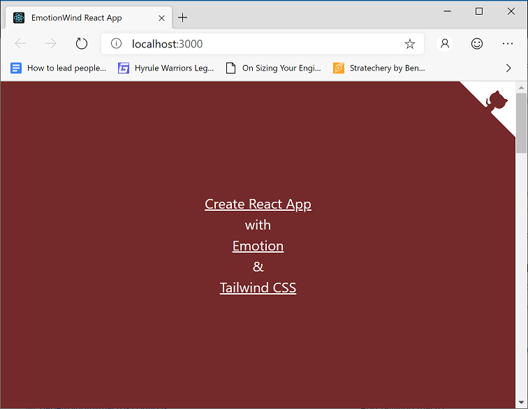

Get up and running fast with [Create React App][create react app] (CRA), [Emotion], and [Tailwind CSS] by cloning the [cra-tailwind-emotion-starter] git repo:

```bash
git clone https://github.com/aedificatorum/cra-tailwind-emotion-starter.git my-app
cd my-app
npm install
npm start
```



## Tailwind CSS

### Tailwind Config

The only change from the default is to add a custom colour (aptly named `customcolor`) to the themes. The tailwind config is used by both the static CSS and the `tw` macro.

```js
/* src/styles/tailwind.js */

module.exports = {
  theme: {
    extend: {
      colors: {
        customcolor: "#fde396",
      },
    },
  },
  variants: {},
  plugins: [],
}
```

### Static CSS

By default only the [base styles] have been added to the static CSS (skipping components and utilities). Anchor has also been updated to be underlined. Note that the `tw` macro will inline styles, so there is no need to add the component and utility classes here.

```css
/* src/styles/tailwind.css */

@tailwind base;

a {
  @apply underline;
}
```

PostCSS is used to transform this to `tailwind.out.css`, which is imported by `index.js`. The output file is in `.gitignore`.

### `tw` Macro

The `tw` macro allows Tailwind to be used directly by a JSS (CSS in JS) library. In this case we're using [Emotion] - see below for examples.

## Emotion

The `App.js` contains a few different ways you can use Tailwind and Emotion together. The below example is a simplified version that demonstrates the various ways to use Emotion or Emotion + Tailwind, in additin to calling out which imports are required in each scenario.

```js
/* src/App.js */

import tw from "tailwind.macro"
/** @jsx jsx */
import { css, jsx } from "@emotion/core"
import styled from "@emotion/styled"

const Section = styled.div`
  ${tw`bg-red-900 min-h-screen flex flex-col items-center justify-center text-xl text-white`};
`

function App() {
  return (
    <React.Fragment>
      <Section
        css={{
          backgroundColor: "black",
        }}
      >
        This requires the pragma + jsx import
      </Section>
      <Section
        css={css`
          color: hotpink;
          background-color: white;
        `}
      >
        This requires the css import
      </Section>
      <Section css={tw`bg-teal-300`}>This uses the Tailwind macro (tw)</Section>
      <Section css={tw`bg-customcolor`}>
        And this uses the custom color defined in <pre>tailwind.js</pre>
      </Section>
    </React.Fragment>
  )
}

export default App
```

For more information see the docs on [Emotion styled components], the [Emotion css prop].

## Credits

The following posts were helpful in putting this starter app together:

- [React and Tailwind]
- [Tailwind CSS in JS]

[cra-tailwind-emotion-starter]: https://github.com/aedificatorum/cra-tailwind-emotion-starter.git
[create react app]: https://facebook.github.io/create-react-app/
[tailwind css]: https://tailwindcss.com/
[emotion]: https://emotion.sh/docs/introduction
[base styles]: https://tailwindcss.com/docs/adding-base-styles
[emotion styled components]: https://emotion.sh/docs/styled
[emotion css prop]: https://emotion.sh/docs/css-prop
[react and tailwind]: https://blog.nardsparagas.com/cra-and-tailwind/
[tailwind css in js]: https://wetainment.com/articles/tailwind-css-in-js/
