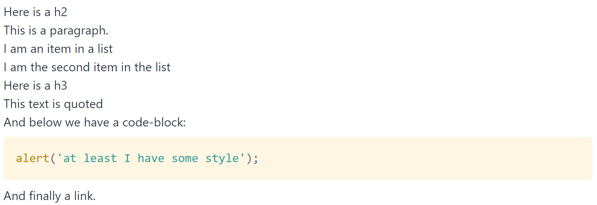
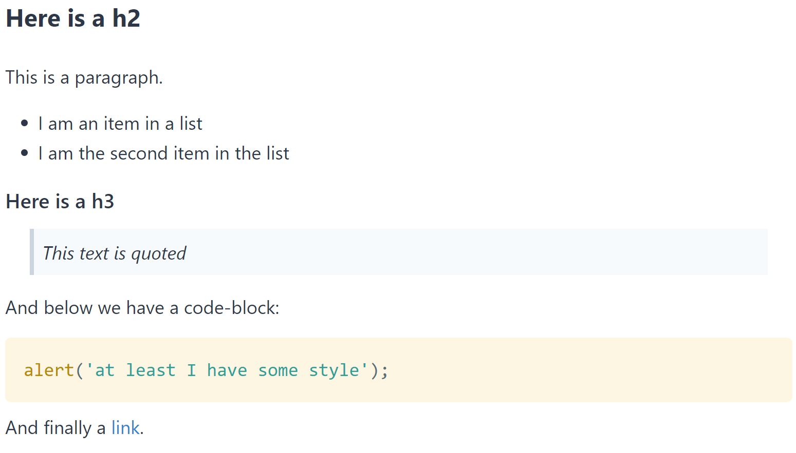

I'm slowly working on migrating the blog from [Jekyll] to [GatsbyJS]. I've decided to use [Tailwind CSS] to style the blog, which means that out of the box (once Tailwind's pretty [aggressive reset][tailwind preflight] has been applied) all the markdown posts end up being unstyled. In the below example the only styling on any element comes courtesy of the [gatsby-remark-prismjs] package, which handles code styling.



After adding some styling to the `site.css` file we're able to get the post looking halfway decent.



I wanted to keep the Tailwind reset applied to the non-markdown parts of the site, so the blog template renders each post into a `div` with the `markdown` class, and the `site.css` is updated to include the below definitions. I'm using [Purge CSS] to strip unused classes, and because these classes aren't directly used anywhere (e.g. `className="..."`) we need to tell Purge CSS to ignore them.

> Watch out for PurgeCSS and Prism! If you don't specify `prismjs/` as an ignore, your production builds will be unstyled. PurgeCSS only runs for production builds (`gatsby build`), so make sure you test the look & feel of your site after doing a production build, or you might be surprised when you deploy...

````css
/* purgecss start ignore */
/* Markdown Styles */
/* Global */
.markdown {
  @apply leading-relaxed text-sm;
}

@screen sm {
  .markdown {
    @apply text-base;
  }
}

@screen lg {
  .markdown {
    @apply text-lg;
  }
}

/* Headers */
.markdown h1,
.markdown h2 {
  @apply text-xl my-6 font-semibold;
}
.markdown h3,
.markdown h4,
.markdown h5,
.markdown h6 {
  @apply text-lg my-3 font-semibold;
}

@screen sm {
  .markdown h1,
  .markdown h2 {
    @apply text-2xl;
  }
  .markdown h3,
  .markdown h4,
  .markdown h5,
  .markdown h6 {
    @apply text-xl;
  }
}

/* Links */
.markdown a {
  @apply text-blue-600;
}
.markdown a:hover {
  @apply underline;
}
/* Paragraph */
.markdown p {
  @apply mb-4;
}
/* Lists */
.markdown ul,
.markdown ol {
  @apply mb-4 ml-8;
}
.markdown li > p,
.markdown li > ul,
.markdown li > ol {
  @apply mb-0;
}
.markdown ol {
  @apply list-decimal;
}
.markdown ul {
  @apply list-disc;
}
/* Blockquotes */
.markdown blockquote {
  @apply p-2 mx-6 bg-gray-100 mb-4 border-l-4 border-gray-400 italic;
}
.markdown blockquote > p {
  @apply mb-0;
}
/* Tables */
.markdown td,
.markdown th {
  @apply px-2 py-1 border border-gray-400;
}
.markdown tr:nth-child(odd) {
  @apply bg-gray-100;
}
.markdown table {
  @apply mb-6;
}

/* Wrap any inline highlights `that are really long`, but don't modify
   the setting for codeblocks (inside ```), which are rendered in as:
   <pre><code>...
*/
.markdown :not(pre) > code.language-text {
  white-space: pre-line;
}
/* purgecss end ignore */
````

This is a pretty workable solution for most of my posts, though there are still a few areas I'd like to improve (notably padding for images, and the appearance at a few breakpoints isn't ideal).

### Further Reading

The following posts were incredibly helpful in getting Gatsby and Tailwind configured:

- [Install Gatsby with Tailwind CSS and PurgeCSS from Scratch]
- [Using Tailwind with Gatsby]

If you do decide to take the plunge with Tailwind I strongly suggest you read through [what the preflight does][tailwind preflight], as it really does reset things!

[jekyll]: https://jekyllrb.com/
[gatsbyjs]: https://www.gatsbyjs.org/
[tailwind css]: https://tailwindcss.com
[tailwind preflight]: https://tailwindcss.com/docs/preflight/
[gatsby-remark-prismjs]: https://github.com/gatsbyjs/gatsby/tree/master/packages/gatsby-remark-prismjs
[purge css]: https://www.purgecss.com/
[install gatsby with tailwind css and purgecss from scratch]: https://ericbusch.net/install-gatsby-with-tailwind-css-and-purgecss-from-scratch
[using tailwind with gatsby]: https://www.jerriepelser.com/blog/using-tailwind-with-gatsby/
