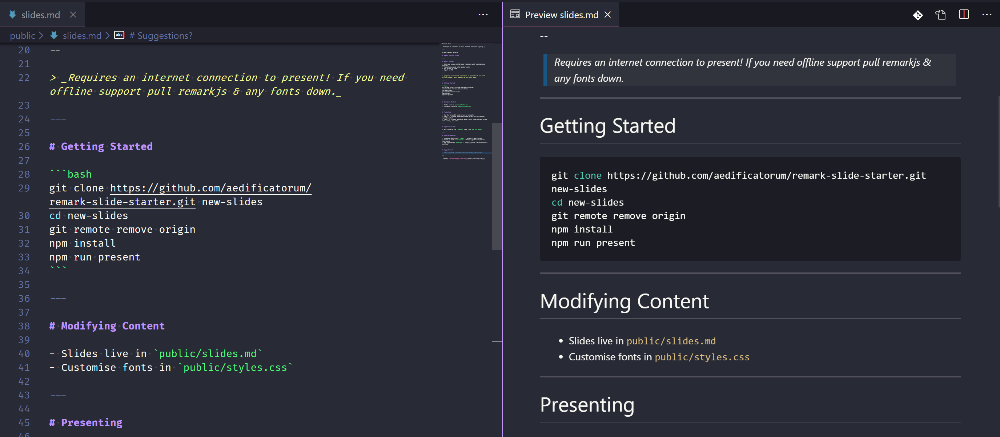

After spending so long authoring technical blog posts/documentation in [Markdown], it's a jarring transition to get dropped back into PowerPoint or Keynote and produce a useful technical presentation...I found myself pasting a lot of _screenshots_ of code, or fighting with formatting. The good news is there are plenty of libraries out there which allow you to author in Markdown.

I start all my technical presentations with the [remark-slides-starter], that is built on [Remark], [DeckTape], and [Live Server]. If you want to get started right away:

```bash
git clone https://github.com/aedificatorum/remark-slide-starter.git new-slides
cd new-slides
npm install
npm run present
```

> You'll need nodejs installed for this to work. I recommend VS Code as the editor for your Markdown slides.

Otherwise read on for some details of the changes I made, and why I think this is a great default for your presentations.

## Author - Remark

[Remark] is an in-browser slideshow tool that is driven by Markdown, and supports a couple of enhancements to Markdown that fill in a few gaps that are needed for presentations (speaker notes, slide build, formatting and layout). Crucially for me, it also has great syntax highlighting out of the box.

The default remark setup has you paste the contents of your slides into a `textarea` - this works but it means you'll get no syntax highlighting, and large presentations can get pretty unwieldy.

To combat this I split my slides out into one (or more) Markdown files, and load them in with JavaScript. This has the added benefit of allowing slide re-use (import the fragment to multiple presentations):

```html
<!-- index.html -->
<body>
  <textarea id="source"></textarea>
  <script src="https://remarkjs.com/downloads/remark-latest.min.js"></script>
  <script>
    fetch("/slides.md").then((response) => {
      response.text().then((value) => {
        document.getElementById("source").innerHTML = value
        window.slideshow = remark.create()
      })
    })
  </script>
</body>
```

As a result of this split you can use VS Code's preview functionality as you work on the slides:



I'd encourage you to check out the [Remark Slideshow][remark] as well as the [Remark Wiki] to get an overview of all the functionality provided.

All styles and fonts overrides are contained in the `styles.css` file.

> Note that there is an incredibly popular library called remark (which lives in the GitHub org remarkJS) - it has _nothing_ to do with the remark library I'm discussing in this post. The fact that the Remark slide library owns the remarkjs.com domain name only adds to the confusion!

## Export - DeckTape

[DeckTape] provides PDF export functionality. In order to use you'll need to be serving your presentation, and then run the export command. DeckTape works by spinning up a headless Chrome instance and 'printing' the slides. The results are great, though it can take a little while if you have a very long presentation (50+ slides).

```bash
# In one terminal
npm run present

# In another terminal
npm run export
```

By default the slides will export to a file named `slides.pdf`.

## Present - Live Server

The starter uses [Live Server] to run the presentation. This will launch a web server that serves the contents of the `public` folder, and will be available by default on port 8080. Browse to [http://localhost:8080/index.html](http://localhost:8080/index.html) to see your presentation.

> If you need to customise the port, edit the `package.json` file

The great (greatest?) thing about Live Server is support for hot reload - as you edit any file (CSS, Markdown) the server will reload the file and you'll see your changes right away.

> Live Server is super-useful as a standalone tool - if you want to quickly serve any file or folder you can run `npx live-server file-or-folder`.

[Remark] has a few tricks up it's sleeve for presentation mode. Try pressing `P` to enable presenter mode, giving you access to speaker notes, and a view of the next slide. If you press `C` you'll launch a second window which mirrors the current slide, and allows you to effectively present on a second screen.

## I need more!

If [Remark] isn't enough for you, then there are quite a few options of Markdown-driven-slideshows out there. A good starting point is the list of [DeckTape examples] - it lists a few frameworks and links to live demos in addition to the exported PDF.

I'm really interested in [MDX Deck] as it allows for React components to be embedded in the presentation (via [MDX] - Markdown with JSX).

[remark-slides-starter]: https://github.com/aedificatorum/remark-slide-starter
[remark]: https://remarkjs.com
[remark wiki]: https://github.com/gnab/remark/wiki
[decktape]: https://github.com/astefanutti/decktape
[decktape examples]: https://github.com/astefanutti/decktape#examples
[live server]: https://github.com/tapio/live-server
[mdx deck]: https://github.com/jxnblk/mdx-deck
[mdx]: https://mdxjs.com/
[markdown]: https://www.markdownguide.org/
