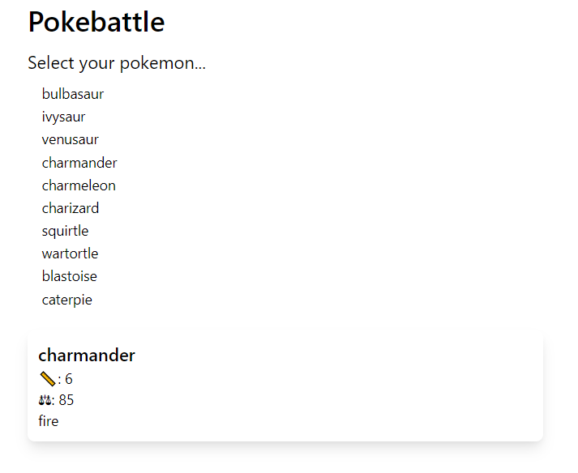

## The Problem

When developing apps I'll sometimes want to mock a dependency for reasons other than unit testing:

- Simulating flaky behaviour - error responses, slow calls, etc.
- Rapid prototyping of the API experience (before building the implementation)
- Working offline
- Deploying demo apps with an ephemeral backend (reload to start again!)

> I'm a big fan of [create react app](CRA), so as much as possible I try to avoid ejecting - as such the rest of this post explores a solution to keep us within CRA.

This typically starts out with something like:

```javascript
import { getAllPokemon, getPokemon } from "./api-store"
// } from './memory-store'
```

Judicious use of toggling the comments definitely gets the job done, though once you go beyond a small handful of files it becomes error prone (releasing dev code to prod...).

To solve the issue of the comments being everywhere we can use an [environment variable][create react app env variables] - though unfortunately we can't use it to dynamically import. The following code is what we're trying to do:

```javascript
// This is not valid code!
import {
  getAllPokemon,
  getPokemon
}
from process.env.REACT_APP_PROD ?
  './api-store'
  : './memory-store';
```

The solution I settled on uses [craco] (Create React App Configuration Override) to let us modify the webpack config _without_ ejecting, and the [webpack normal module replacement plugin][module replacement plugin]. Once we're done the code will look like this:

```javascript
import { getAllPokemon, getPokemon } from "./APP_TARGET-store"
```

The example app is available on GitHub in the [craco swap example repo][craco swap example]. [This commit][craco implementation commit] contains all the changes needed to implement craco.



## From comments to craco

### Initial State

The starting state for our migration is our app which contains two backends. The code below shows how our `getPokemon` call is implemented in the api and in-memory versions:

```javascript
// api-store.js
const getPokemon = async (name) => {
  const result = await fetch(`https://pokeapi.co/api/v2/pokemon/${name}`)
  const resultJson = await result.json()
  const pokemon = { name: resultJson.name, height: resultJson.height }
  return pokemon
}

// memory.js
const getPokemon = async (name) => {
  // pokemon is a hard-coded array
  return pokemon.find((p) => name === p.name)
}

// app.js
import { getAllPokemon, getPokemon } from "./api-store"
// } from './memory-store'
```

> For this implementation swap to work the method signatures and return types must be the same. One of my favourite mistakes when mocking an SDK is to forget to make my implementations `async`.

### Add craco

In addition to craco I'm installing `cross-env`, which allows an environment variable to be set in a way that works over Mac and Windows.

```bash
yarn add craco
yarn add cross-env
```

Once `craco` has been installed, you need to update your `package.json` to use the `craco` command instead of `react-scripts`. This ensures that any configuration overrides we specify will get picked up.

We're also adding a new start method which will set an environment variable. This is how we'll decide which implementation is built, and I typically leave the default (no variable) to build the production version.

```json
"scripts": {
  "start": "craco start",
  "start:memory": "cross-env REACT_APP_MEMORY_STORE=1 craco start",
  "build": "craco build",
  "test": "craco test",
  "eject": "react-scripts eject"
}
```

At this point your app should still work - though you need to toggle comments in order to switch implementations. We'll fix that next.

### Swap implementations based on an environment variable

To hook into webpack we'll create a `craco.config.js` file in our project root. We check to see if the environment variable is set, and if so use the `memory` implementation, otherwise default to `api`. We then add a plugin and tell it that if it gets any requests to import a module with `APP_TARGET` in the name (e.g. from an `import` statement), to replace `APP_TARGET` with either `api` or `memory`, and import that instead.

```javascript
const webpack = require("webpack")

module.exports = function () {
  const appTarget = process.env.REACT_APP_MEMORY_STORE ? "memory" : "api"

  return {
    webpack: {
      plugins: [
        new webpack.NormalModuleReplacementPlugin(
          /(.*)APP_TARGET-(\.*)/,
          function (resource) {
            resource.request = resource.request.replace(
              /APP_TARGET-/,
              `${appTarget}-`
            )
          }
        ),
      ],
    },
  }
}
```

We now need to modify our code to request the import as follows:

```javascript
import { getAllPokemon, getPokemon } from "./APP_TARGET-store"
```

And with that we're done - a different experience when we `yarn start` vs. `yarn start:memory`!

> Any changes to `craco.config.js` will require you to restart the dev server, as the file is only process at build/compile time.

[module replacement plugin]: https://webpack.js.org/plugins/normal-module-replacement-plugin/
[create react app]: https://create-react-app.dev/
[create react app env variables]: https://create-react-app.dev/docs/adding-custom-environment-variables/
[craco]: https://github.com/gsoft-inc/craco
[craco swap example]: https://github.com/aedificatorum/craco-swap-example
[craco implementation commit]: https://github.com/aedificatorum/craco-swap-example/commit/7d268c9a45ba24eb9b2c9785c49b8dc026fb909d
