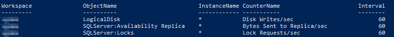

[Log Analytics] is a great product - easy to get data ingested, and easy to query it.  It's also pretty easy to run up a sizeable bill (with the cost being based on GB ingested).  I've found it helpful to regularly review what is being ingested to a workspace, which I typically do with the following query:

```kql
Usage
| where TimeGenerated > ago(30d)
| where IsBillable == true
| summarize TotalVolumeGB = sum(Quantity) / 1024 by Solution, DataType
| order by TotalVolumeGB desc
```

You'll get to know which solutions are data heavy pretty fast (I'm looking at you [Wire Data] and [DNS Analytics]).  Something I've recently spent some time on is performance counters - after the `Perf` data type crept to the top of the list, so I drilled into that with the `_BilledSize` property:

```kql
Perf
| where TimeGenerated > ago(30d)
| summarize TotalVolumeGB = sum(_BilledSize) / pow(1024, 3) by ObjectName, CounterName // Computer
| order by TotalVolumeGB desc
```

A recent review showed a fair amount of performance counter overlap between workspaces - my suspicion was that we were ingesting the same counters in multiple workspaces.  The following script dumps all counters ingested to any workspace, along with their target instance and frequency.  A reliable way to drive up your ingestion costs are the `Process/% Processor Time` counter ingested for every instance (`*`) at a frequency of 10 seconds.

We got rid of that one pretty fast.

```powershell
Import-Module Az

Connect-AzAccount

$allPerfCounters = @()

$subscriptions = Get-AzSubscription
foreach ($subscription in $subscriptions) {
  $subscription | Set-AzContext

  $workspaces = Get-AzOperationalInsightsWorkspace

  foreach ($workspace in $workspaces) {

    $perfCounters = Get-AzOperationalInsightsDataSource -Kind WindowsPerformanceCounter -Workspace $workspace

    foreach ($counter in $perfCounters) {
      $allPerfCounters += [pscustomobject]@{
        Subscription  = $subscription.Name
        ResourceGroup = $counter.ResourceGroupName
        Workspace     = $counter.WorkspaceName
        ObjectName    = $counter.Properties.ObjectName
        InstanceName  = $counter.Properties.InstanceName
        CounterName   = $counter.Properties.CounterName
        Interval      = $counter.Properties.IntervalSeconds
      }
    }
  }
}
$allPerfCounters | Format-Table
```



Along with a bit of Excel and the results from the earlier queries, it was easy to work through the list and cut down on ingestion costs.

For more information on understanding costs I've found the following articles helpful:

- [Manage usage and costs with Azure Monitor logs]
- [Manage usage and estimated costs in Azure Monitor]

[Log Analytics]: https://docs.microsoft.com/en-us/azure/azure-monitor/log-query/log-query-overview
[Wire Data]: https://docs.microsoft.com/en-us/azure/azure-monitor/insights/wire-data
[DNS Analytics]: https://docs.microsoft.com/en-us/azure/azure-monitor/insights/dns-analytics
[Manage usage and costs with Azure Monitor logs]: https://docs.microsoft.com/en-us/azure/azure-monitor/platform/manage-cost-storage
[Manage usage and estimated costs in Azure Monitor]: https://docs.microsoft.com/en-us/azure/azure-monitor/platform/usage-estimated-costs