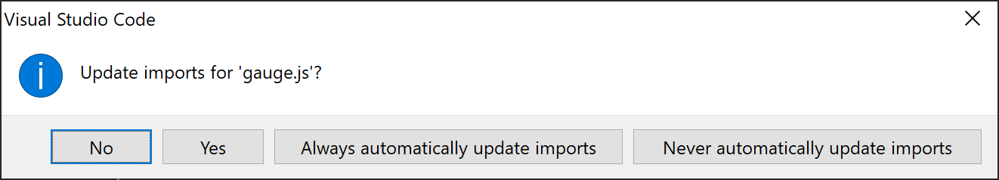

I'd like to say that all my time writing relative import statements like this has taught me some valuable lessons:

```js
import Gauge from "../../../components/Gauge";
```

However, I can safely say that if I could go back in time and send myself a link to this post that all I'd be sacrificing is a bunch of frustration, and instead of the above I'd be able to write:

```js
import Gauge from "components/Gauge";
```

It also means that VS Code's helpful attempts (which for me have had mixed results) at fixing imports when moving files around becomes a thing of the past.



The good news is that this is a very easy fix, as both create-react-app (CRA) and Next.js (Next) will read from `jsconfig.json` (if it exists) during the build process.

> To learn more about the `jsconfig.json` file, including other benefits it proves, configuration options, and best practices, check the [Visual Studio Code documentation on jsconfig][jsconfig docs]

The file needs to go in the root of your project folder, and the contents vary based on whether you're in a CRA or Next project:

```json
// jsconfig.json for create-react-app
{
  "compilerOptions": {
    "baseUrl": "src"
  },
  "include": ["src"]
}

// jsconfig.json for Next.js
{
  "compilerOptions": {
    "baseUrl": "."
  },
  "exclude": ["node_modules"]
}
```

The key difference is which folder is the base - for Next it's the root (`.`) folder, and for CRA it's the `src` folder.

We also want to ensure we exclude `node_modules`, which is explicit for Next (`"exclude": ["node_modules"]`) and implicit for CRA (accomplished by only `"include": ["src"]`).  This does not impact your ability to import and use packages (e.g. `import React from "react"` still works), but it does stop VS Code to not attempt to index and provide intellisense on your `node_modules` folder.

So, now you've saved some time (and frustration) by binning relative imports, perhaps it's time to consider [type checking your JavaScript][type check js]?  If I've wasted minutes on relative imports, then I think I'm into hours (or days!) lost that `"checkJs": true` could have saved me.

[jsconfig docs]: https://code.visualstudio.com/docs/languages/jsconfig
[type check js]: https://code.visualstudio.com/docs/nodejs/working-with-javascript#_type-checking-javascript