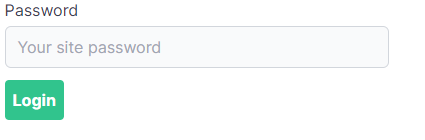

Want to password-protect some or all of your [Next.js] site, but want to stick with a free-tier hosting plan? This blog post will walk through the steps to add the following lightweight protection to your deployment:



If you'd like to jump straight to the source code there is an [example repo on Github][example repo] which is also deployed to Vercel. See the [public page][example site - public] as well as a [protected page][example site - protected] (the password is `letmein`).

## Why roll our own password protection?

In a few cases I've wanted to protect one or more pages on a site, but haven't had any need (or desire!) to integrate an authentication/authentication framework.

Adding password protection with a hosting provider is possible, but expensive. [Surge][surge pricing] requires you to be on a $30/month plan, [Netlify][Netlify pricing] needs the $45/month plan, and with [Vercel][vercel protect deployments] it's a $150/month addon to the pro plan (which is already \$20/month).

You obviously get a lot more for your money than just password protection, and I'd hope their implementations are more robust than what you'll find here (though I couldn't find any documentation on the password protection implementation).

Some notable issues with what we'll build today are:

- No rate limiting
- No Captcha
- Password stored in cleartext in a cookie
- No protection for static files (in `public`)
- Requires opting-in on a per-page, per-api-route basis

I definitely wouldn't put anything sensitive behind this protection - I typically use it to protect early proof of concepts or as a placeholder for authentication.

And finally, implementing this will disable Next's [automatic static optimization] as every page will need some server-side logic (checking if your password cookie is correct). If you were wondering why there aren't many (any?) hosting providers that support password protection on the free tier, this might help explain why.

## Getting started

You can either start from a blank Next app, or use one of the templates below to get up and running with a starter that has [Tailwind CSS], ESLint, and Pretttier, and optionally Typescript. Note this post will assume you're using the JavaScript example.

```bash
# Vanilla
npx create-next-app next-password-protected

# or Javascript
npx create-next-app next-password-protected --example https://github.com/aedificatorum/next-starters/tree/main/tailwind-js

# or TypeScript
npx create-next-app next-password-protected --example https://github.com/aedificatorum/next-starters/tree/main/tailwind
```

And then run it:

```bash
cd next-password-protect
yarn dev
# browse to http://localhost:3000
```

Our goals are to take this app and:

- Allow anyone to visit the main page (`/`)
- Add a protected page (`/protected`)
- Add a login/logout page (`/login`)

## Creating a protected page

Create a new `protected.js` in the `pages` folder, and add the following code:

```jsx
// /pages/protected.js

import Head from "next/head"

export default function Protected({ hasReadPermission }) {
  if (!hasReadPermission) {
    return <div>Access denied.</div>
  }

  return (
    <div>
      <Head>
        <title>Protected Page</title>
      </Head>

      <main>I am supposed to be protected.</main>
    </div>
  )
}
```

If you browse to `/protected` you'll now get the access denied message.

## Injecting the hasReadPermission prop

We're going to handle setting this prop in the `_app.js` file, which you'll need to add to the `pages` folder. This leverages the [custom app] feature of Next, and will run this logic for every page.

```js
// /pages/app.js

import App from "next/app"

function MyApp({ Component, pageProps }) {
  return <Component {...pageProps} />
}

MyApp.getInitialProps = async (appContext) => {
  const appProps = await App.getInitialProps(appContext)

  if (Math.random() > 0.5) {
    appProps.pageProps.hasReadPermission = true
  }

  return { ...appProps }
}

export default MyApp
```

In our initial implementation we're going to give you a 50% chance of viewing the page on each refresh. Try it a couple of times, and you should get to see both access denied, and the protected content.

## Protecting with a cookie

Rather than roll the dice on every refresh, we'll now check a cookie on each request. To do so we'll use the [universal cookie][npm - universal cookie] package, which lets us work with cookies in both node and the browser with one package/API:

```bash
yarn add universal-cookie
```

We'll put our cookie name in a consts file (debugging cookie name typos is great fun, but we'll skip that step today):

```js
// /consts.js
export default {
  SiteReadCookie: "src",
}
```

And now we'll check this cookie to see if the client has the right password, by updating `_app.js`:

```js
// /pages/app.js

// At the top of _app.js
import Cookies from "universal-cookie"
import consts from "consts"

// In the getInitialProps function, instead of our 'random' proteciton
const cookies = new Cookies(appContext.ctx.req.headers.cookie)
const password = cookies.get(consts.SiteReadCookie) ?? ""

if (password === "letmein") {
  appProps.pageProps.hasReadPermission = true
}
```

> My consts file is in the root folder (not the pages folder), though I've got [absolute imports] configured, so no need to import from `../consts`.

If you check the `/protected` page you'll now see you can't access it any more. If you add a cookie with the right password (letmein) in the dev tools you'll be able to get in again.

Keep in mind we've put the password in the source code, so if your source isn't private this is a bit of security theatre. If the source is going to be public you could use an environment variable instead.

## Adding password entry

In this case 'logging in' means setting a cookie to the password value. To do this we'll create a login component, and then replace the 'Access Denied' view on the page with the login component.

To do that first create a login component. Note the below is styled with [Tailwind CSS] with the [tailwind ui][npm - tailwindcss ui] package for [custom forms][npm - tailwindcss custom forms]:

```jsx
// /components/login.js

import { useState } from "react"
import Cookies from "universal-cookie"
import consts from "consts"

const Login = ({ redirectPath }) => {
  const [password, setPassword] = useState("")

  return (
    <div className="w-1/3 max-w-sm mx-auto">
      <form>
        <label className="block">
          <span className="text-gray-700">Password</span>
          <input
            type="text"
            className="form-input mt-1 block w-full bg-gray-50"
            placeholder="Your site password"
            value={password}
            onChange={(e) => setPassword(e.target.value)}
          ></input>
        </label>
        <button
          type="submit"
          className="mt-3 bg-green-400 text-white p-2 font-bold rounded hover:bg-green-600"
          onClick={(e) => {
            e.preventDefault()
            const cookies = new Cookies()
            cookies.set(consts.SiteReadCookie, password, {
              path: "/",
            })
            window.location.href = redirectPath ?? "/"
          }}
        >
          Login
        </button>
      </form>
    </div>
  )
}

export default Login
```

Our component accepts a single optional prop (`redirectPath`) which allows us to redirect the client after they set the cookie. Note that we use `window.location.href` as the redirect _must_ trigger a request to the server, and we don't want Next to attempt to use client-side routing.

We can now add our login component to our protected page, and render the Login component if the client doesn't have permission to see the page. This means they either don't have the cookie, or they have the cookie but the password is wrong.

```jsx
// /pages/protected.js

// At the top of protected.js
import { useRouter } from "next/router"
import Login from "components/Login"

// Inside our function component
const router = useRouter()

if (!hasReadPermission) {
  return <Login redirectPath={router.asPath} />
}
```

If you refresh the page you can now try setting the wrong password, or the right password.

## Adding a logout page

Right now the only way to 'logout' is to clear your cookies, and while testing you'll appreciate having a logout button.

To solve this we'll add a `login` page in the `pages` folder which will allow people to login and logout:

```jsx
import Head from "next/head"
import Cookies from "universal-cookie"
import Login from "Components/Login"
import consts from "consts"

export default function LoginPage({ hasReadPermission }) {
  if (hasReadPermission) {
    return (
      <>
        <Head>
          <title>Logout</title>
        </Head>
        <div className="w-1/3 max-w-sm mx-auto">
          <button
            className="mt-3 bg-green-400 text-white p-2 font-bold rounded hover:bg-green-600"
            onClick={(e) => {
              e.preventDefault()
              const cookies = new Cookies()
              cookies.remove(consts.SiteReadCookie, { path: "/" })
              window.location.href = "/login"
            }}
          >
            Logout
          </button>
        </div>
      </>
    )
  }

  return (
    <>
      <Head>
        <title>Login</title>
      </Head>
      <Login redirectPath="/" />
    </>
  )
}
```

If you browse to `/login` you'll now be able to login or logout.

## Conclusion

You've now got basic password protection functionality deployed. Keep in mind that you must add this protection manually to every page you don't want to be public. If you'd like to protect the whole site without messing around with the prop on each page you could handle that in the `_app.js`, redirecting to a login endpoint or returning a 403.

Even with blanket protection in your `_app.js` keep in mind that your API routes will need protecting individually, as `_app.js` only executes for pages.

Hope this was helpful and/or educational!

[next.js]: https://nextjs.org/
[example repo]: https://github.com/taddison/next-password-protect-sample
[example site - public]: https://next-password-protect-sample.vercel.app/
[example site - protected]: https://next-password-protect-sample.vercel.app/protected
[surge pricing]: http://surge.sh/pricing
[netlify pricing]: https://www.netlify.com/pricing/
[vercel protect deployments]: https://vercel.com/blog/protecting-deployments
[absolute imports]: /blog/2020/04/absolute-imports-with-react/
[tailwind starter with typescript]: https://github.com/aedificatorum/next-starters/tree/main/tailwind-js
[tailwind starter]: https://github.com/aedificatorum/next-starters/tree/main/tailwind
[automatic static optimization]: https://nextjs.org/docs/advanced-features/automatic-static-optimization
[custom app]: https://nextjs.org/docs/advanced-features/custom-app
[npm - universal cookie]: https://www.npmjs.com/package/universal-cookie
[tailwind css]: https://tailwindcss.com
[npm - tailwindcss ui]: https://www.npmjs.com/package/@tailwindcss/ui
[npm - tailwindcss custom forms]: https://www.npmjs.com/package/@tailwindcss/custom-forms
