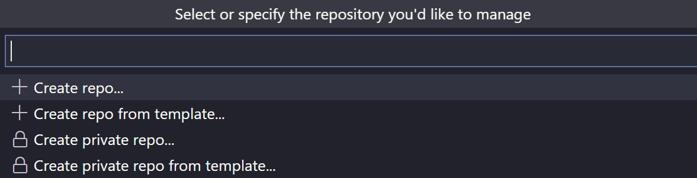
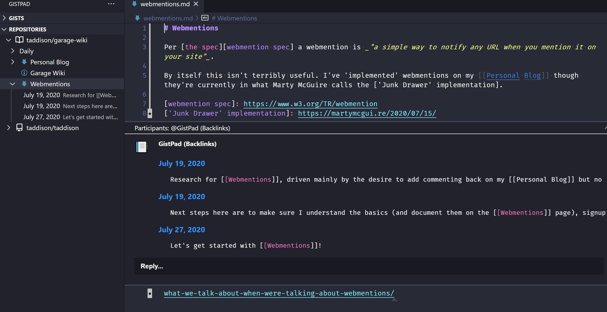
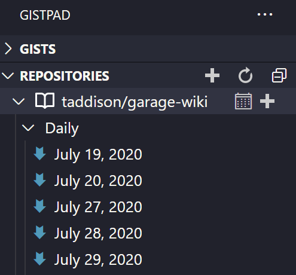

I love [GistPad] - it has redefined how I think about working with a markdown based wiki in GitHub. [VSCode] is my preferred editor for markdown - adding the [Gistpad extension][gistpad] takes it to the next level.

## From work journal to digital garden

I previously wrote about [keeping a work journal with VSCode], and while it was OK, the friction of git (pull, commit, push) really broke the flow. Once I started exploring other knowledge-management systems (see [awesome knowledge management]) I realized what I was really after was a [digital garden].

The ability to link between notes (pages, files, etc.) is key - and so the manual work log didn't scale very far. Browser-based systems like [OneNote] and [Roam Research] are closer but have other limitations (price, not markdown, a lot of ceremony in splitting by personal/work/client, etc.). [Foam] is an exciting newcomer, but still leaves you to manage the `git` work yourself.

The digital gardens I have (and continue to have) the most success with are actually in [OneNote] (once configured it's just so easy to access, share, cross-link). As they were mostly private (family or work related) the lack of an easy way to share publicly wasn't really an issue.

Recently I've wanted to start [working with the garage door up], and after randomly seeing a tweet on [using GistPad for knowledge bases] the last thing holding me back (that damned `git` workflow!) was no longer an excuse. Thank you to whatever Twitter algorithm put that tweet into my feed!

It's only been a few weeks but I'm totally hooked on GistPad and cannot imagine this workflow without it. [Managing repos] is only one of _many_ features - and some of them could easily be extensions in their own right (e.g. managing gists, code tours, playgrounds). I'd highly recommend browsing the [readme][gistpad readme] and looking at the demos of what it can do.

If you just want to start managing (or just start!) your digital garden, it's only a few steps...

## Managing a repo

Get started by installing the [GistPad] extension. To configure it you'll need to provide a GitHub personal access token with the `repo` permission, which you can create on the [new token] page.

By default you'll see all of your Gists and a Showcase - but what we're after is a repo.

Open the command pallete and run `GistPad: Manage Repository`. This will give you a list of all your repos, as well as the chance to create a public or private repo.

I created a public one and called it `garage-wiki`, as any repo with `wiki` in the name will get special wiki treatment from [GistPad]. One of the most significant changes you'll get by being in wiki mode is that you can use `[[double brackets]]` to create internal links, and [GistPad] will also maintain _backlinks_.

An example of how those backlinks show up is below - you can see that I've linked to my webmentions page from three different daily journal entries.

And now you're done - you can create, edit, and delete files in the repo - and as soon as you hit save the changes will be synced back to GitHub. No add/commit/push required.

If you're into journalling you can click the calendar icon next to your repo and it'll create a new page for the current day.

Right now the extension is getting updates all the time, so I would strongly recommend you browse the relevant section of the [readme][gistpad readme]. The ongoing updates around support for [Foam] are particularly interesting if you're thinking about building your digital garden/personal knowledge base.

In closing, I 😍 [GistPad] - make sure you give it a try!

[gistpad]: https://marketplace.visualstudio.com/items?itemName=vsls-contrib.gistfs
[gistpad readme]: https://github.com/vsls-contrib/gistpad#readme
[vscode]: https://code.visualstudio.com/
[keeping a work journal with vscode]: /blog/2018/02/keeping-a-work-journal-with-vs-code/
[awesome knowledge management]: https://github.com/brettkromkamp/awesome-knowledge-management
[digital garden]: https://maggieappleton.com/garden-history
[onenote]: https://www.onenote.com/
[roam research]: https://roamresearch.com/
[foam]: https://github.com/foambubble/foam
[managing repos]: https://github.com/vsls-contrib/gistpad#repositories
[working with the garage door up]: https://notes.andymatuschak.org/z21cgR9K3UcQ5a7yPsj2RUim3oM2TzdBByZu
[using gistpad for knowledge bases]: https://twitter.com/LostInTangent/status/1282047676377231360
[garage wiki]: https://github.com/taddison/garage-wiki
[new token]: https://github.com/settings/tokens/new
