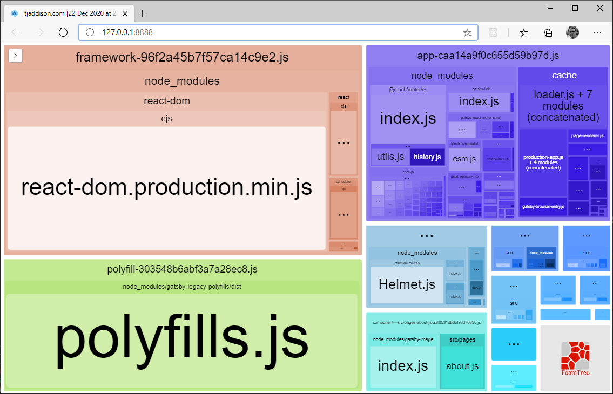

Gatsby will do a great job of serving up a well optimized site - but it is constrained by what _you told it_ to serve. If keeping your site lean is important to you, then looking at your bundle size (and what's in that bundle) before and after adding any new dependencies can be illuminating. If you're currently happy with performance (hundreds dof kilobytes of JavaScript can be added and you'll still score a perfect 100 on a [web.dev test]) then I highly recommend [Dan Luu]'s [web bloat]. After you've read that and now feel duly chastened about the state of the modern web, let's look at two ways to analyze your Gatsby site's bundle - interactive, and build-time reports.

## Configuring the webpack size plugin

There are a couple of Gatsby plugins which will add [webpack-bundle-analyzer] for you, though I've opted to consume that package directly.

> Gatsby plugins that are wrappers for other packages can be really hit or miss. Will they expose all the features you want, and be updated in a timely manner? In many cases I've opted to consume the packages directly and skip the Gatsby plugin as the amount of code needed is small and I appreciate the opportunity to learn more about the bundler and the analyzer plugin. If you prefer to stick with Gatsby plugins then I'd suggest [gatsby-plugin-webpack-bundle-analyser-v2].

First of all you'll need to install the plugin (I'm using `yarn` in my examples):

```shell
yarn add webpack-bundle-analyzer -D
```

Next you need to add the following to `gatsby-node.js`:

```javascript
const BundleAnalyzerPlugin = require("webpack-bundle-analyzer")
  .BundleAnalyzerPlugin

exports.onCreateWebpackConfig = ({ stage, actions }) => {
  const analyzerMode = process.env.INTERACTIVE_ANALYZE ? "server" : "json"

  if (stage === "build-javascript") {
    actions.setWebpackConfig({
      plugins: [
        new BundleAnalyzerPlugin({
          analyzerMode,
          reportFileName: `./__build/bundlereport.json`,
        }),
      ],
    })
  }
}
```

The [docs for onCreateWebpackConfig] explain the different stages, and we only want to run the analyzer plugin when we're building our production JavaScript bundles (`build-javascript`) - this stage only runs during a `gatsby build`, and not during development.

The arguments we pass through are explained in the below sections and determine if we want to look at our bundle size interactively, or in a JSON report.

## Viewing bundle sizes interactively

To explore the current state of your bundle I'd suggest running the analyzer in _interactive_ mode. This will launch a server (defaulting to `localhost:8888`) that hosts an interactive treemap of your bundles:



To launch the analyzer in interactive mode we need to configure an environment variable (`INTERACTIVE_ANALYZE`). To support Windows we'll first add the [cross-env] package:

```shell
yarn add cross-env -D
```

And we'll then add a new script that will launch the build process with this environment variable.

```json
/* package.json */
scripts: {
  "analyze": "cross-env INTERACTIVE_ANALYZE=1 npm run build"
}
```

Once you run the `analyze` script the analyzer page will launch in a browser when the build process completes.

Something to keep in mind is that all of these bundles aren't loaded for every page/every browser. A good example is the `polyfills.js` bundle which [won't be loaded on older browsers at all].

## Reporting on bundle sizes at build time

By default every `gatsby build` will log the bundle stats to the file `__build/bundlereport.json`. You can see the [current bundle stats for tjaddison.com].

> If you don't want to upload your bundle report to your production site you can either gate the stats behind another environment variable (which you won't set for publishing).

Where this really shines is comparing releases - I use [Netlify] to deploy my site and take advantage of [deploy previews] to preview every pull request as a branch. This publishes my branch (including my `buildreport.json`), which allows me to take those files and compare the bundle sizes of the branch compared to production.

As I make so few changes to the bundles right now I'm eyeballing the numbers - by using the below code I can print out the stats from production and a branch (in this case I'm comparing the before/after numbers from updating to tailwindcss 2.0 and bumping a few other dependencies):

```javascript
const logParsedReport = (report) => {
  let parsedTotal = 0
  let gzipTotal = 0

  for (const file of report) {
    const { label, parsedSize, gzipSize } = file
    parsedTotal += parsedSize
    gzipTotal += gzipSize
    console.log(`Name: ${label} - ${parsedSize} parsed (${gzipSize} gzip)`)
  }

  console.log("---------")
  console.log(`Total ${parsedTotal} (${gzipTotal} gzip)`)
}

const prod = "https://tjaddison.com/__build/bundlereport.json"
const branch =
  "https://5fc8401d8292a600084390dd--fervent-lovelace-f75e7a.netlify.app/__build/bundlereport.json"

fetch(prod).then((res) => {
  res.json().then((json) => {
    logParsedReport(json)
  })
})
fetch(branch).then((res) => {
  res.json().then((json) => {
    logParsedReport(json)
  })
})
```

This gives the following output (which I've truncated for brevity):

```
Name: 942fc3de6d17fbede2785a28a3625a2fd54381eb-469888aa0543c06173b4.js - 18354 parsed (6526 gzip)
Name: app-5ff60cbc19fc47db0c13.js - 66067 parsed (18874 gzip)
Name: component---cache-caches-gatsby-plugin-offline-app-shell-js-16703ee5599528db9f93.js - 499 parsed (351 gzip)
...
---------
Total 341617 (111583 gzip)

Name: 942fc3de6d17fbede2785a28a3625a2fd54381eb-0efa3ed3379b611c2795.js - 18152 parsed (6444 gzip)
Name: app-fd4d3ac6b7f96cbbf5f8.js - 74754 parsed (22347 gzip)
Name: component---cache-caches-gatsby-plugin-offline-app-shell-js-16703ee5599528db9f93.js - 499 parsed (351 gzip)
...
---------
Total 349385 (114705 gzip)
```

Happily this change has reduced the total bundle size - though as the code isn't actually doing a diff I couldn't tell you where. If you come up with a better piece of diffing code for the output please let me know!

[web.dev test]: https://web.dev/measure/
[dan luu]: https://danluu.com/
[web bloat]: https://danluu.com/web-bloat/
[webpack-bundle-analyzer]: https://github.com/webpack-contrib/webpack-bundle-analyzer
[gatsby-plugin-webpack-size]: https://github.com/axe312ger/gatsby-plugin-webpack-size
[gatsby-plugin-webpack-bundle-analyser-v2]: https://github.com/JimmyBeldone/gatsby-plugin-webpack-bundle-analyser-v2
[docs for oncreatewebpackconfig]: https://www.gatsbyjs.com/docs/how-to/custom-configuration/add-custom-webpack-config/
[cross-env]: https://www.npmjs.com/package/cross-env
[won't be loaded on older browsers at all]: https://github.com/gatsbyjs/gatsby/issues/28736
[current bundle stats for tjaddison.com]: https://tjaddison.com/__build/bundlereport.json
[netlify]: https://www.netlify.com/
[deploy previews]: https://docs.netlify.com/site-deploys/overview/#deploy-preview-controls
