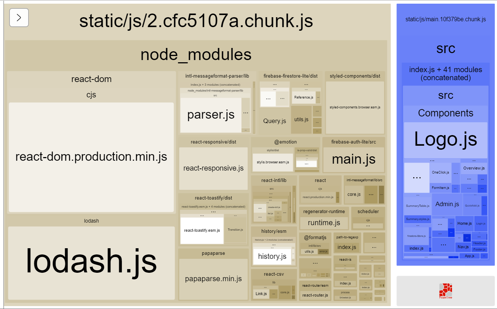

After looking at my [Gatsby site bundle size last month] I figured I should do the same for a few [create-react-app (CRA)][cra] based sites. If you're wondering _why_ you might want to do that, check out the previous post, otherwise read on for the details.

> The following steps have been tested with CRA 4

## Step 1 - Dependencies

The plugin we'll use to analyze bundle size is [webpack-bundle-analyzer].

To avoid ejecting we'll be using [CRACO (Create React App Configuration Override)][craco] to let us add webpack plugins to the build.

And finally we'll use [cross-env] to customize our build scripts in a way that will work on Windows too.

```shell
yarn add webpack-bundle-analyzer @craco/craco cross-env -D
```

## Step 2 - Inject bundle analyzer plugin

Create the `craco.config.js` file in your projects root folder, and paste the below JavaScript in. When we wire CRACO up this will load the analyzer plugin for any production builds. Additionally, it'll default to dumping a json report file in the output folder (useful for CI builds), and only launch the interactive analyzer when the `REACT_APP_INTERACTIVE_ANALYZE` environment variable is set.

```javascript
// craco.config.js
const webpack = require("webpack")
const BundleAnalyzerPlugin =
  require("webpack-bundle-analyzer").BundleAnalyzerPlugin

module.exports = function ({ env }) {
  const isProductionBuild = process.env.NODE_ENV === "production"
  const analyzerMode = process.env.REACT_APP_INTERACTIVE_ANALYZE
    ? "server"
    : "json"

  const plugins = []

  if (isProductionBuild) {
    plugins.push(new BundleAnalyzerPlugin({ analyzerMode }))
  }

  return {
    webpack: {
      plugins,
    },
  }
}
```

## Step 3 - Wire up CRACO

Modify the `package.json` file to use CRACO:

```diff
"scripts": {
-   "start": "react-scripts start",
+   "start": "craco start",
-   "build": "react-scripts build",
+   "build": "craco build"
-   "test": "react-scripts test",
+   "test": "craco test"
+   "analyze": "cross-env REACT_APP_INTERACTIVE_ANALYZE=1 npm run build"
}
```

The new `analyze` command will set the environment variable required to launch the interactive analyzer. We have to prefix our environment variable with `REACT_APP_` to [have it injected by CRA][custom env].

## Step 4 - Take a look at your bundles

Your production builds will now have a `report.json` in the root folder that you can consume from CI builds or look at in production. If you want to use the interactive analyzer you can run the analyze command:

```shell
yarn analyze
```



[gatsby site bundle sizes last month]: /blog/2020/11/monitoring-your-gatsbyjs-bundle-size/
[cra]: https://create-react-app.dev/
[webpack-bundle-analyzer]: https://github.com/webpack-contrib/webpack-bundle-analyzer
[craco]: https://github.com/gsoft-inc/craco
[cross-env]: https://www.npmjs.com/package/cross-env
[custom env]: https://create-react-app.dev/docs/adding-custom-environment-variables/
