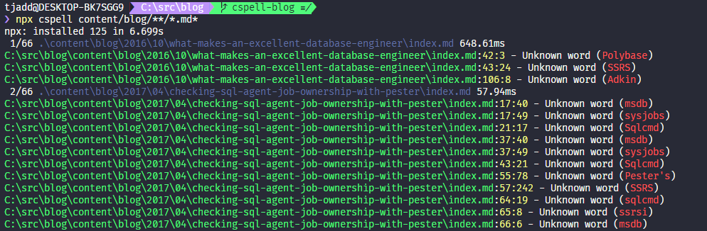

I love authoring in Markdown as there is almost no friction - just write. When the time comes to publish though - at minimum you'll want a preview, and a spell check. If you're using VS Code then the [code spell checker extension] is the fastest way to get started (don't be fooled by the fact it says 'code spell checker' - it'll happily check any file, including Markdown).

But what if you've got a lot of posts you want to check? And what if perhaps you haven't been all that fastidious about spell-checking your posts in the past? That's where I was a few weeks ago, and I was happy to find there's a simple solution that requires nothing more than Node 12...

## Checking all files in a folder

To check all files anywhere under the `content/posts` folder that are either Markdown (`.md`) or MDX (`.mdx`) we can use [cspell] by running:

```bash
npx cspell content/posts/**/*.md*
```

We'll then see every file and any unknown words:



> Running this in the VS Code terminal allows you to CTRL-click any of the errors and be taken straight to that word in the file.

This is the same library that powers the [code spell checker extension] (that's what the c stands for in cspell), which means you'll see the same errors reported on the command line and when viewing the file.

This is a good start, but what if we're not happy with the defaults cspell uses?

## Changing the cspell defaults

If you're using the VS Code extension then by default any changes you make to the settings will be reflected in the `.vscode/settings.json` file - which probably isn't what you want if you plan on doing anything with cspell from the command line.

I suggest you create a `cspell.json` file in the root of your folder:

```json
{
  "version": "0.1"
}
```

And now any changes you make in the context of the workspace will be placed in this file, which is also used by default when running cspell from the command line. As an example, if I wanted to ensure a particular repo was always checked using British English (rather than the American English default) I could add the following to the `cspell.json` file:

```json
{
  "version": "0.1",
  "language": "en-GB"
}
```

The options available in the file are documented on the [cspell GitHub page][cspell].

## Handling unknown words

After you've worked through actual spelling mistakes, you'll likely be left with a lot of unknown words that need to be added to a dictionary or ignored. There are multiple ways to handle this (cspell allows for adding or ignoring words at the user, workspace, file, or block/line level). The workflow I've settled on is:

- Words that are probably correct in any context I'll add to the user dictionary (these end up in the VS Code user `settings.json`)
- Words which are specific to a repo (abbreviations, technical terms) I'll add to the workspace dictionary (these end up in `cspell.json`)
- Words which are only correct in a specific file I'll add to _that file_
- Words which are not correct but should be ignored I'll ignore for _that file_

My blog posts all contain yaml frontmatter which gives me a great place to place words I want to add/ignore for that file only - this is done with comments and some cspell keywords.

```yaml
---
title: My first blog post
# cSpell:words tjaddison Addison
# cSpell:ignore COOOOOOL
---

```

This isn't a great example as I'd probably want my blog name (tjaddison) and my surname (Addison) to be added to the workspace dictionary. Because they're added as words they are eligible to appear as suggestions. If I'd used the word 'COOOOOOL' anywhere in the post I'd probably not want to repeat myself (and really I should be asking myself why I'd used it in the first place).

> When working on any repos with other collaborators I generally try to avoid adding words to the user dictionary - otherwise those words will show up as unknown for anyone else running a spell check on that repo.

## Installing cspell as a dev dependency

If you want to shave a few seconds off your `npx cspell` command and your repo happens to be a Node.js project then you can add `cspell` as a dev dependency:

```bash
npm install cspell --D
```

This allows you to add it as a script in your `package.json`:

```json
"scripts": {
  "spell": "cspell content/blog/**/*.md"
}
```

## Next steps

I've only scratched the surface on what is possible with the [cspell package][cspell] and the [VS Code extension][code spell checker extension] - the documentation for the package is worth reading through to get an idea of what can be accomplished. There are a handful of [custom dictionaries] available, and once you've got your unknown count down to zero it might be worth [adding spell checking to your build].

I'm still working on getting my unknown count down to zero, and along the way I've fixed some really terrible typos. Sorry if you've had the misfortune of encountering any of those - at least going forwards I've got a handle on them.

[code spell checker extension]: https://marketplace.visualstudio.com/items?itemName=streetsidesoftware.code-spell-checker
[cspell]: https://github.com/streetsidesoftware/cspell/tree/master/packages/cspell
[custom dictionaries]: https://github.com/streetsidesoftware/cspell-dicts
[adding spell checking to your build]: https://seankilleen.com/2021/01/adding-spell-checking-to-my-blogs-build-process-with-github-actions-and-cspell/
