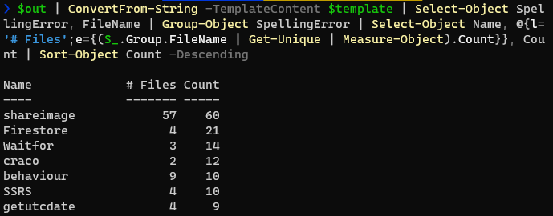

After [configuring cspell for my blog][cspell post], I was confronted with over 600 errors to work through. Looking through the list it was clear that in many cases I only needed to add some words to the `cspell.json` workspace dictionary (though in some cases I just couldn't spell). Rather than going through each file and playing whack-a-mole I decided to aggregate all the errors and rank them:



This told me how many times the 'error' showed up, and in how many files. My thinking here was that if the word was ubiquitous then I should probably add it to the `cspell.json` file, and if it only showed up in one file then that file might be a better place.

> This is personal preference, and mainly driven by the fact that technology can be a bit of an alphabet soup of acronyms, and as I write fairly broadly a huge custom dictionary may let typos slip through. In cases where it was an English word I'd always add it to the workspace dictionary, and in some cases where the word appeared in multiple files I'd still opt for per-file overrides (if the word was a niche technical term that could look like a typo).

So, how does the above command work?

## PowerShell to the rescue

We start by capturing the output of the `cspell` command:

```powershell
$out = npx cspell content/**/*.md*

# $out Contains one row per error:
# C:\src\blog\content\blog\2020\12\analyze-your-create-react-app-bundle-size-without-ejecting\index.md:82:70 - Unknown word (gatsbyjs)
# C:\src\blog\content\blog\2017\04\checking-sql-agent-job-ownership-with-pester\index.md:17:40 - Unknown word (msdb)
# ...snip...
```

We can leverage the excellent [ConvertFrom-String] command to pull the various items out by constructing a template:

```powershell
$template = @'
{FileName*:C:\src\blog\content\blog\2020\12\analyze-your-create-react-app-bundle-size-without-ejecting\index.md}:82:70 - Unknown word ({SpellingError:gatsbyjs})
{FileName*:C:\src\blog\content\blog\2017\04\checking-sql-agent-job-ownership-with-pester\index.md}:17:40 - Unknown word ({SpellingError:msdb})
'@
```

We've specified that the `FileName` appears multiple times with an asterisk (`FileName*`), which generates a record for every occurrence of `FileName` and it's associated `SpellingError`. Passing this template to `ConvertFrom-String` over our output gives us:

```powershell
$out | ConvertFrom-String -TemplateContent $template

# FileName      : C:\src\blog\content\blog\2020\12\analyze-your-create-react-app-bundle-size-without-ejecting\index.md
# SpellingError : gatsbyjs
# RunspaceId    : 8bc74548-2f8c-4f2b-b350-5f2d5c2dc033

# FileName      : C:\src\blog\content\blog\2017\04\checking-sql-agent-job-ownership-with-pester\index.md
# SpellingError : msdb
# RunspaceId    : 8bc74548-2f8c-4f2b-b350-5f2d5c2dc033

# ...snip...
```

All that's left now is to group these by `SpellingError`, and then include a count of files with that error as well as a raw count. The grouping and counting is straightforward - where it gets interesting is the unique count.

We're adding a custom property on `Select-Object` by creating a hashtable (which takes a label/expression pair). The group (from `Group-Object`) contains an array of all the objects in that group, so we can count the unique values of `FileName` with `Get-Unique` and `Measure-Object`. It's a rather busy one-liner.

```powershell
$out | ConvertFrom-String -TemplateContent $template | Select-Object SpellingError, FileName | Group-Object SpellingError | Select-Object Name, @{l='# Files';e={($_.Group.FileName | Get-Unique | Measure-Object).Count}}, Count | Sort-Object Count -Descending
```

## The full script

```powershell
$out = npx cspell content/**/*.md*

$template = @'
{FileName*:C:\src\blog\content\blog\2020\12\analyze-your-create-react-app-bundle-size-without-ejecting\index.md}:82:70 - Unknown word ({SpellingError:gatsbyjs})
{FileName*:C:\src\blog\content\blog\2017\04\checking-sql-agent-job-ownership-with-pester\index.md}:17:40 - Unknown word ({SpellingError:msdb})
'@

$out | ConvertFrom-String -TemplateContent $template | Select-Object SpellingError, FileName | Group-Object SpellingError | Select-Object Name, @{l='# Files';e={($_.Group.FileName | Get-Unique | Measure-Object).Count}}, Count | Sort-Object Count -Descending
```

[cspell post]: /blog/2021/02/spell-checking-your-markdown-blog-posts-with-cspell/
[convertfrom-string]: https://docs.microsoft.com/en-us/powershell/module/microsoft.powershell.utility/convertfrom-string
