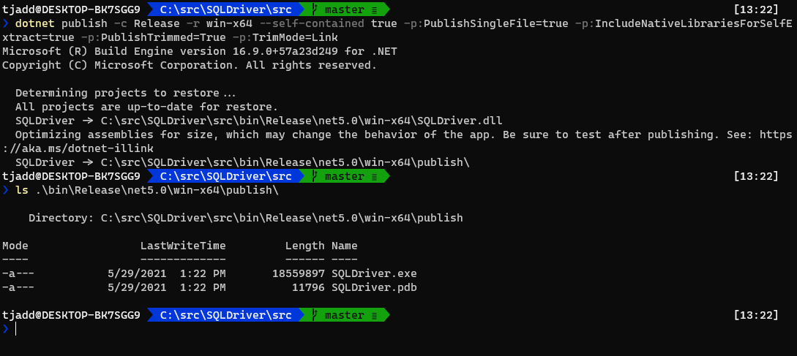

Assuming you want to target Windows:

```shell
dotnet publish -c Release -r win-x64 --self-contained true -p:PublishSingleFile=true -p:IncludeNativeLibrariesForSelfExtract=true
```

And if you want to reduce the size (taking advantage of [trimming]):

```shell
dotnet publish -c Release -r win-x64 --self-contained true -p:PublishSingleFile=true -p:IncludeNativeLibrariesForSelfExtract=true -p:PublishTrimmed=True -p:TrimMode=Link
```

If you'd like some background and an explanation of those options then read on.

## Background and Motivation

I build a small benchmarking tool ([SQLDriver]), and after updating to .NET 5 recently I realized that anyone using it may need to install an updated runtime. I'd previously made an effort to keep the executable as easy to download and use as possible (using [ILMerge] to bundle dependent assemblies into the executable), so wondered how easy things were with .NET 5?

## Self-Contained

A self-contained .NET application is one that doesn't rely on there being any shared components on the target machine (such as the .NET runtime). This feature has actually been around for several years, and the only downside is that it can end up publishing a lot of additional files along with the app (which also mean a simple console app can be 60MB+).

Getting this to work requires a single flag:

```shell
dotnet publish -c Release -r win-x64 --self-contained true
```

Read more on the Microsoft docs site: [Self-contained publishing].

## Single-File

Rather than dozens (or hundreds) of files, this option publishes only a handful of files, with the rest being unzipped into memory when the app is launched:

```shell
dotnet publish -c Release -r win-x64 --self-contained true -p:PublishSingleFile=true
```

The reason there isn't a single file (which is what you might expect!) is that only managed DLLs are bundled into the executable, and the native binaries (part of the .NET runtime) are left as separate files. You can have the native binaries bundled by specifying the following:

```shell
dotnet publish -c Release -r win-x64 --self-contained true -p:PublishSingleFile=true -p:IncludeNativeLibrariesForSelfExtract=true
```

> In .NET Core 3.x the `PublishSingleFile` option also bundled native binaries. The `IncludeNativeLibrariesForSelfExtract` option is new wih .NET 5, where the default is to not bundle the native binaries.

Read more on the Microsoft docs site: [Single-file deployment and executable].

## Trimming

The final step for me was to enable [trimming]. Available only for self-contained apps, this feature allows bundling of only the assemblies that are used (rather than the entire .NET runtime):

```shell
dotnet publish -c Release -r win-x64 --self-contained true -p:PublishSingleFile=true -p:IncludeNativeLibrariesForSelfExtract=true -p:PublishTrimmed=True
```

We can go one step further and remove unused code from assemblies (rather than whole assemblies only):

```shell
dotnet publish -c Release -r win-x64 --self-contained true -p:PublishSingleFile=true -p:IncludeNativeLibrariesForSelfExtract=true -p:PublishTrimmed=True -p:TrimMode=link
```

The downside to trimming (including the more aggressive `link` option) is that there are certain scenarios where the build-time analysis may incorrectly identify code as unused, which will result in a runtime error. The docs call out [components that can cause trimming problems] - and in my case the application was very simple and _also_ very easy to test for correctness.

Read more on the Microsoft docs site: [Trim self-contained deployments and executables].

## Conclusion

As a result of the self-contained, single-file, and trimming options I was able to get SQLDriver down to a single ~18MB executable that doesn't require anything to be installed on the target machine.



[trimming]: https://docs.microsoft.com/en-us/dotnet/core/deploying/trim-self-contained
[sqldriver]: https://github.com/taddison/SQLDriver
[ilmerge]: https://github.com/dotnet/ILMerge
[self-contained publishing]: https://docs.microsoft.com/en-us/dotnet/core/deploying/#publish-self-contained
[single-file deployment and executable]: https://docs.microsoft.com/en-us/dotnet/core/deploying/single-file
[components that can cause trimming problems]: https://docs.microsoft.com/en-us/dotnet/core/deploying/trim-self-contained#components-that-cause-trimming-problems
[trim self-contained deployments and executables]: https://docs.microsoft.com/en-us/dotnet/core/deploying/trim-self-contained
