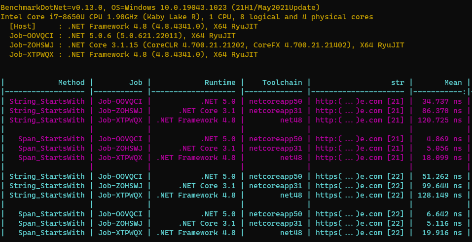

It's never been easier to run benchmarks against multiple runtimes with [BenchmarkDotNet]. Maybe you're checking your performance improvements benefit all runtimes targeted by your library code (that may support multiple [target frameworks]). Maybe you're curious to see if the relentless march of runtime improvements will benefit some of your existing code? Whatever the reason, with a couple of lines of code you can generate benchmarks like this:



I first saw this technique explained in the [performance improvements in .NET 5 post] which made it easier to understand than the [toolchains documentation]. The rest of this post doesn't introduce anything not already covered in the post/docs, but might be easier to digest.

## Setup

We're going to compare the performance of `String.StartsWith` to `Span.StartsWith` under:

- .NET Framework 4.8 ([download developer pack][net48 sdk])
- .NET Core 3.1 ([download SDK][net31 sdk])
- .NET 5 ([download SDK][net5 sdk])

We'll then create a new console app for our benchmarks:

```shell
dotnet new console --name spanBench
```

This bootstraps a new console application in the `spanBench` folder.

## Project File

We're going to make three changes to our `spanBench.csproj` file:

- Add the additional target frameworks (using the appropriate _Target Framework Moniker_ for each, see [target frameworks])
- Add the [BenchmarkDotNet] dependency
- Conditionally add the [System.Memory] package when targeting .NET Framework 4.8 (the `System.Span` type is included in the runtime from .NET Core 2.1)

```xml
<Project Sdk="Microsoft.NET.Sdk">
  <PropertyGroup>
    <OutputType>Exe</OutputType>
    <TargetFrameworks>net5.0;netcoreapp3.1;net48</TargetFrameworks>
  </PropertyGroup>

  <ItemGroup>
    <PackageReference Include="BenchmarkDotNet" Version="0.13.0" />
  </ItemGroup>

  <ItemGroup Condition=" '$(TargetFramework)' == 'net48' ">
    <PackageReference Include="System.Memory" Version="4.5.4" />
  </ItemGroup>
</Project>
```

## Benchmark Code

The code is configured to use [BenchmarkSwitcher], which allows you to specify which benchmarks to run via the command line, or interactively (if no `filter` argument is passed). We've also added the `MemoryDiagnoser` attribute to collect information about allocations. The benchmarks are fairly simple and will each be executed with two different arguments.

```csharp
using System;
using BenchmarkDotNet.Attributes;
using BenchmarkDotNet.Running;
using BenchmarkDotNet.Diagnosers;

namespace SpanPerf
{
    [MemoryDiagnoser]
    public class Program
    {
        static void Main(string[] args) => BenchmarkSwitcher.FromAssemblies(new[] { typeof(Program).Assembly }).Run(args);

        [Arguments("http://www.google.com")]
        [Arguments("https://www.google.com")]
        [Benchmark]
        public bool String_StartsWith(string str)
        {
            return str.StartsWith("https://");
        }

        [Arguments("http://www.google.com")]
        [Arguments("https://www.google.com")]
        [Benchmark]
        public BotDetails Span_StartsWith(string str)
        {
            return str.AsSpan().StartsWith("https://".AsSpan());
        }
    }
}
```

## Running the benchmark

With everything in place the below command will run all 12 benchmarks (2 methods x 2 arguments x 3 runtimes):

```shell
dotnet run --configuration Release --framework net48 --runtimes net48 netcoreapp31 netcoreapp50 --filter * --join
```

The first two arguments are for the `dotnet run` command:

- Use the release configuration (never benchmark with debug!)
- Build using the .NET Framework 4.8 surface area

The final three arguments are forwarded to BenchmarkDotNet's `Run` method:

- `runtimes` specifies the runtimes we want to benchmark with
- `filter` in this case specifies every benchmark in the assembly
- `join` outputs all results at the end, rather than after each individual benchmark

[target frameworks]: https://docs.microsoft.com/en-us/dotnet/standard/frameworks
[benchmarkdotnet]: https://benchmarkdotnet.org/
[performance improvements in .net 5 post]: https://devblogs.microsoft.com/dotnet/performance-improvements-in-net-5/
[toolchains documentation]: https://benchmarkdotnet.org/articles/configs/toolchains.html
[net5 sdk]: https://dotnet.microsoft.com/download/dotnet/5.0
[net31 sdk]: https://dotnet.microsoft.com/download/dotnet/3.1
[net48 sdk]: https://dotnet.microsoft.com/download/dotnet-framework/net48
[system.memory]: https://www.nuget.org/packages/System.Memory/
[benchmarkswitcher]: https://benchmarkdotnet.org/articles/guides/how-to-run.html#benchmarkswitcher
