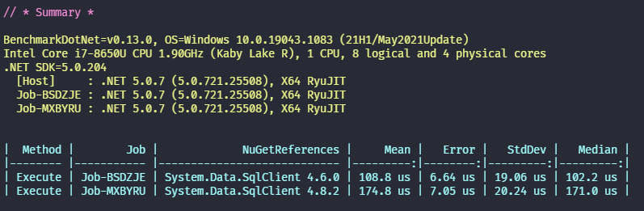
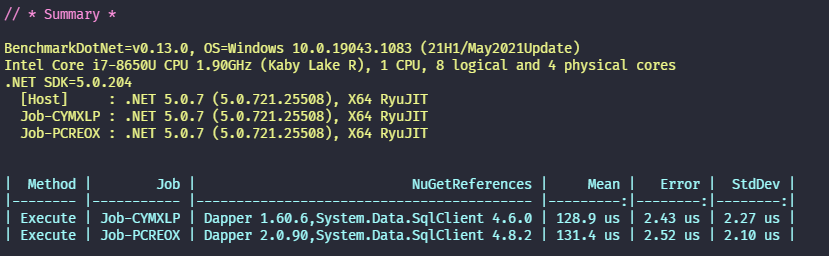

Last month I looked at [benchmarking different runtimes] to see what impact updating to the latest version of .NET might have. But what if you're curious about package updates too? [BenchmarkDotNet] has us covered there too - it allows you to configure your benchmarks to run against [multiple versions of the same package]. We can also leverage that functionality to benchmark different packages that provide implementations for the same abstract class or interface (e.g. `DbConnection` as implemented in `Microsoft.Data.SqlClient` and `System.Data.SqlClient`).

> If you'd like jump right into an example project with all the bells and whistles check the [SqlClientUpdate benchmark on GitHub].

The rest of this post will walk through:

- Benchmarking two different versions of a package
- Benchmarking different sets of package
- Benchmarking different packages that implement a common abstract class
- Benchmarking all of the above with different runtimes

## Benchmarking two different versions of a package

We'll start by quickly scaffolding an app and adding a benchmark for connecting to SQL Server with [System.Data.SqlClient] and [Dapper]. First of all create the app and install the packages - we're going to be looking at changes in data access, so we'll install version of those packages that correspond to March 2019:

```shell
dotnet new console
dotnet add package BenchmarkDotNet
dotnet add package Dapper -v 1.60.6
dotnet add package System.Data.SqlClient -v 4.6.0
```

> It's important to install the lowest version of the package you want to benchmark, as if you install the latest version restores of the lower version will fail.

Next we'll modify our `Program.cs` to use `BenchmarkSwitcher` to launch our benchmarks:

```csharp
// Program.cs
using BenchmarkDotNet.Running;

public class Program
{
  public static void Main(string[] args) => BenchmarkSwitcher.FromAssemblies(new[] { typeof(Program).Assembly }).Run(args);
}
```

And add a very minimal benchmark implementation to `SqlClientBenchmark.cs`:

```csharp
// SqlClientBenchmark.cs
using BenchmarkDotNet.Attributes;
using Dapper;

public class SqlClientBenchmark
{
  private static string CONNECTION_STRING = "server=localhost;integrated security=sspi";

  private System.Data.Common.DbConnection _connection;

  [GlobalSetup]
  public void Setup() => _connection = new System.Data.SqlClient.SqlConnection(CONNECTION_STRING);

  [GlobalCleanup]
  public void Cleanup() => _connection.Dispose();

  [Benchmark]
  public void Execute() => _connection.Execute("SELECT 1");
}
```

If we wanted to see what the impact of upgrading `System.Data.SqlClient` to the latest version would be, we need to use a [Config][benchmarkdotnet configs]:

```csharp
// SqlClientBenchmark.cs
using BenchmarkDotNet.Attributes;
using BenchmarkDotNet.Configs;
using BenchmarkDotNet.Jobs;
using Dapper;

[Config(typeof(Config))]
public class SqlClientBenchmark
{
  private class Config : ManualConfig
  {
      public Config()
      {
        var baseJob = Job.Default;

        AddJob(baseJob.WithNuGet("System.Data.SqlClient", "4.6.0"));
        AddJob(baseJob.WithNuGet("System.Data.SqlClient", "4.8.2"));
      }
  }
  // ...rest of the implementation
```

If we run the benchmark we'll now get one run for each version of `System.Data.SqlClient` specified.

```shell
dotnet run -c Release --filter * --join
```



## Benchmarking two different sets of package versions

We can also pass a list of packages, so our code in `Config` becomes:

```csharp
AddJob(baseJob.WithNuGet(new NuGetReferenceList() {
      new NuGetReference("System.Data.SqlClient", "4.6.0"),
      new NuGetReference("Dapper", "1.60.6"),
  }));

AddJob(baseJob.WithNuGet(new NuGetReferenceList() {
      new NuGetReference("System.Data.SqlClient", "4.8.2"),
      new NuGetReference("Dapper", "2.0.90"),
  }));
```

The benchmark run will now run the benchmark the March 2019 versions against the July 2021 versions of both `Dapper` and `System.Data.SqlClient`.



## Benchmarking different packages that implement a common abstract class

We'll now consider what would happen if rather than upgrading to the latest version of `System.Data.SqlClient`, we instead upgraded to the latest version of `Microsoft.Data.SqlClient`. We'll create a single abstract class `BaseBenchmark` which will hold all the benchmark definitions, and then two classes which implement `BaseBenchmark`, one for each of the `*.SqlClient` packages we want to test.

> You don't have to use abstract classes and multiple implementations, and if you're only benchmarking a single method it is probably overkill (you might want to consider clipboard inheritance instead 😊).

Our base class contains all common code:

```csharp
// BaseBenchmark.cs
using BenchmarkDotNet.Attributes;
using BenchmarkDotNet.Jobs;
using Dapper;

public abstract class BaseBenchmark {
  public static string CONNECTION_STRING = "server=localhost;integrated security=sspi";
  public static Job BaseJob = Job.Default;
  protected System.Data.Common.DbConnection _connection;

  [GlobalCleanup]
  public void Cleanup() => _connection.Dispose();

  [Benchmark]
  public void Execute() => _connection.Execute("SELECT 1");
}
```

And each implementation contains a different `Config`, and connection initialisation:

```csharp
// SystemDataBenchmark.cs
using BenchmarkDotNet.Attributes;
using BenchmarkDotNet.Configs;
using BenchmarkDotNet.Jobs;

[Config(typeof(Config))]
public class SystemDataBenchmark : BaseBenchmark
{
  private class Config : ManualConfig
  {
    public Config()
    {
      AddJob(BaseJob.WithNuGet(new NuGetReferenceList() {
            new NuGetReference("System.Data.SqlClient", "4.6.0"),
            new NuGetReference("Dapper", "1.60.6"),
        }));

      AddJob(BaseJob.WithNuGet(new NuGetReferenceList() {
            new NuGetReference("System.Data.SqlClient", "4.8.2"),
            new NuGetReference("Dapper", "2.0.90"),
        }));
    }
  }

  [GlobalSetup]
  public void Setup() => _connection = new System.Data.SqlClient.SqlConnection(CONNECTION_STRING);
}

// MicrosoftDataBenchmark.cs
using BenchmarkDotNet.Attributes;
using BenchmarkDotNet.Configs;
using BenchmarkDotNet.Jobs;

[Config(typeof(Config))]
public class MicrosoftDataBenchmark : BaseBenchmark
{
  private class Config : ManualConfig
  {
    public Config()
    {
      AddJob(BaseJob.WithNuGet(new NuGetReferenceList() {
            new NuGetReference("Microsoft.Data.SqlClient", "3.0.0"),
            new NuGetReference("Dapper", "1.60.6"),
        }));

      AddJob(BaseJob.WithNuGet(new NuGetReferenceList() {
            new NuGetReference("Microsoft.Data.SqlClient", "3.0.0"),
            new NuGetReference("Dapper", "2.0.90"),
        }));
    }
  }

  [GlobalSetup]
  public void Setup() => _connection = new Microsoft.Data.SqlClient.SqlConnection(CONNECTION_STRING);
}
```

We'll also need to install the new NuGet package:

```shell
dotnet add package Microsoft.Data.SqlClient
```

Running the benchmark now compares all four options:


## Benchmarking all of the above with different runtimes

--

[benchmarking different runtimes]: /blog/2021/06/run-benchmarks-using-multiple-runtimes-with-benchmarkdotnet/
[benchmarkdotnet]: https://benchmarkdotnet.org/
[multiple versions of the same package]: https://benchmarkdotnet.org/articles/samples/IntroNuGet.html
[sqlclientupdate benchmark on github]: https://github.com/taddison/dotnet-sql-benchmarks/tree/main/src/SqlClientUpdate
[system.data.sqlclient]: https://www.nuget.org/packages/System.Data.SqlClient/
[dapper]: https://www.nuget.org/packages/Dapper
[benchmarkdotnet configs]: https://benchmarkdotnet.org/articles/configs/configs.html
