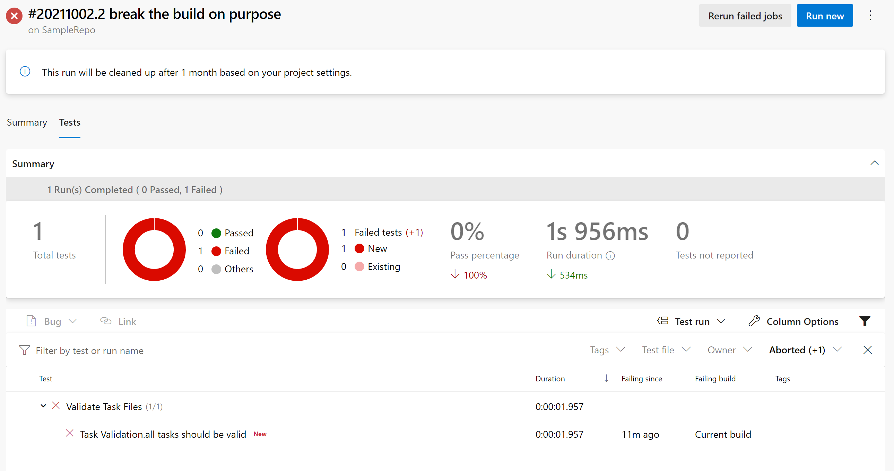

The brevity of the [Migrating from Pester v4 to v5] documentation belies just how much has changed - something that took a fair bit of trial and error for me was getting [Pester] 5 test results published in an [Azure Pipelines] run.

Assuming you have your tests located in a `tests` folder, the pipeline definition needed to run the tests and publish the results is below.

> I could have used `Invoke-Pester -Path tests`, but I frequently find tests which use relative paths, and so invoking them from the correct folder is easier.

```yaml
# /pipelines/azure-pipelines.yml
pool:
  vmImage: windows-2019

steps:
  - task: PowerShell@2
    displayName: "Run Pester tests"
    inputs:
      targetType: "inline"
      script: |
        Set-Location ./tests
        Invoke-Pester -CI
      ignoreLASTEXITCODE: true

  - task: PublishTestResults@2
    inputs:
      testResultsFormat: "NUnit"
      testResultsFiles: "**/Test*.xml"
      failTaskOnFailedTests: true
      testRunTitle: "Validate Task Files"
```

The `-CI` argument to `Invoke-Pester` will save test results in an xml file (NUnitXML compatible) in the same folder. It will also set the exit code of the process to the number of failed tests, which is problematic as any non-zero exit code will abort the pipeline by default. To ensure our pipeline continues when tests fail, we set `ignoreLASTEXITCODE` on the [PowerShell task]. To stop the pipeline in the presence of failed tasks we use the `failTaskOnFailedTests` property of the [Publish Test Results task].

> In the example below, I'm running the [Test-FolderTask] function of [tSqlScheduler], and as you can see when I break the build on purpose, the tests fail 😊.



[migrating from pester v4 to v5]: https://pester.dev/docs/migrations/v4-to-v5
[azure pipelines]: https://azure.microsoft.com/en-us/services/devops/pipelines/
[pester]: https://pester.dev/
[powershell task]: https://docs.microsoft.com/en-us/azure/devops/pipelines/tasks/utility/powershell
[publish test results task]: https://docs.microsoft.com/en-us/azure/devops/pipelines/tasks/test/publish-test-results
[test-foldertask]: https://github.com/DBTrenches/tsqlscheduler/blob/master/src/tsqlScheduler/Public/Test-FolderTasks.ps1
[tsqlscheduler]: https://github.com/DBTrenches/tsqlscheduler
