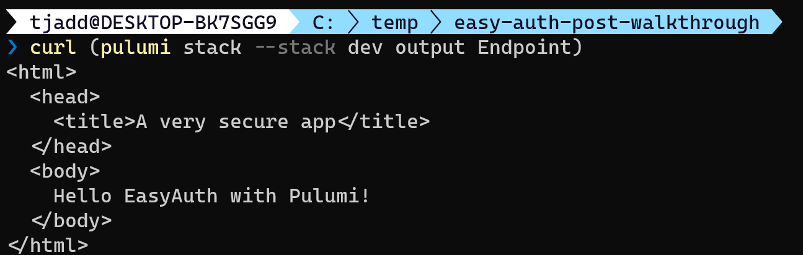
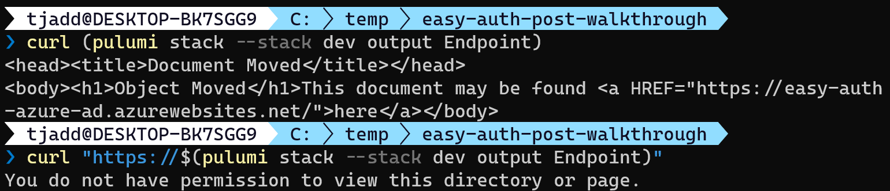

This post will walk through how to use [Pulumi] to deploy an [Azure App Service] application secured with [Easy Auth]. Under the default configuration only authenticated users will be able to access the application, without any custom code (easy auth places an authentication/authorization middleware in front of your app). If you'd like to jump straight to the code you can see a [full example project on GitHub].

> I'll be using Azure Active Directory in this example, though easy auth also supports Microsoft (personal account), Google, Facebook, Twitter, and OpenID Connect.

I'm assuming you've already completed the [Pulumi Azure pre-requisites] (or similar), and have the appropriate permissions in your tenant and Azure subscription. When we're done we'll have deployed a Pulumi stack with the following resources:


## Creating the project

Start by creating the application, and adding the AzureAD package we'll need to create the [Azure AD application registration].

```powershell
pulumi new azure-csharp `
  --name easyauth-webapp `
  --description "azure ad secured app" `
  --stack dev `
  --config azure-native:location=eastus

dotnet add package Pulumi.AzureAD
```

> Note the example defaults to eastus - you can set this to whatever region you want, I've included it here so the script will complete without any prompts.

We next need to update the contents of the `pulumi.dev.yaml` file to contain a few additional config items. Paste the following into the file:

```yaml
config:
  azure-native:location: eastus
  azure-native:subscriptionId: UPDATE_ME
  azure-native:tenantId: UPDATE_ME
  easyauth-webapp:tenantId: UPDATE_ME
  easyauth-webapp:ownerId: UPDATE_ME
  easyauth-webapp:siteName: UPDATE_ME
  easyauth-webapp:appRegistrationName: UPDATE_ME
```

You can set `siteName` and `appRegistrationName` to whatever you want, though for simplicity's sake I'd suggest using the same item. As an example I might pick `easy-auth-azure-ad`.

The `subscriptionId` and `tenantId` should be set to the appropriate target's for your Azure app service and Azure AD application registration, respectively. I recommend setting the `ownerId` to your user's id, otherwise you may find you don't have the permission to modify or delete the application registration after it has been deployed.

The following commands may be helpful in retrieving these values (requires the [Azure CLI]):

```powershell
# Get your user's id
az ad signed-in-user show --query objectId

# List all subscriptions (and their tenant) that you have access to
az account list
```

> Note `tenantId` is set twice as I couldn't figure out how to access the `azure-native:tenantId` via configuration, and it is needed both to set the default tenant for the application registration deployment, and to construct the token issuer URI.

## Deploy the website (no security)

We'll next create the website we want to deploy. We're going to use the [run from ZIP package] functionality to deploy the contents of the `wwwroot` folder. Create that folder and add some content to the `index.htm` file:

```html
<!-- wwwroot/index.htm -->
<html>
  <head>
    <title>A very secure app</title>
  </head>
  <body>
    Hello EasyAuth with Pulumi!
  </body>
</html>
```

Now we can deploy this file to Azure with Pulumi. Modify the `MyStack.cs` file to contain the below code, which has been adapted from the [Pulumi Function Stack example]:

```csharp
// MyStack.cs
using System;
using Pulumi;
using Pulumi.AzureAD;
using Pulumi.AzureAD.Inputs;
using Pulumi.AzureNative.Resources;
using Pulumi.AzureNative.Storage;
using Pulumi.AzureNative.Storage.Inputs;
using Pulumi.AzureNative.Web;
using Pulumi.AzureNative.Web.Inputs;

class MyStack : Stack
{
  public MyStack()
  {
    var config = new Pulumi.Config();
    var tenantId = config.Require("tenantId");
    var ownerId = config.Require("ownerId");
    var siteName = config.Require("siteName");
    var appRegistrationName = config.Require("appRegistrationName");

    var rg = new ResourceGroup($"RG-{siteName}");

    var storageAccount = new StorageAccount("storageaccount", new StorageAccountArgs
    {
      ResourceGroupName = rg.Name,
      Kind = "StorageV2",
      Sku = new SkuArgs
      {
        Name = SkuName.Standard_LRS,
      },
    });

    var appServicePlan = new AppServicePlan("appserviceplan", new AppServicePlanArgs
    {
      ResourceGroupName = rg.Name,
      Kind = "App",
      Sku = new SkuDescriptionArgs
      {
        Tier = "Basic",
        Name = "B1",
      },
    });

    var container = new BlobContainer("zips", new BlobContainerArgs
    {
      AccountName = storageAccount.Name,
      PublicAccess = PublicAccess.None,
      ResourceGroupName = rg.Name,
    });

    var blob = new Blob("appservice-blob", new BlobArgs
    {
      ResourceGroupName = rg.Name,
      AccountName = storageAccount.Name,
      ContainerName = container.Name,
      Type = BlobType.Block,
      Source = new FileArchive("wwwroot"),
    });

    var codeBlobUrl = SignedBlobReadUrl(blob, container, storageAccount, rg);

    var app = new WebApp("app", new WebAppArgs
    {
      Name = siteName,
      ResourceGroupName = rg.Name,
      ServerFarmId = appServicePlan.Id,
      SiteConfig = new SiteConfigArgs
      {
        AppSettings = {
          new NameValuePairArgs{
              Name = "WEBSITE_RUN_FROM_PACKAGE",
              Value = codeBlobUrl,
          }
        },
      }
    });

    this.Endpoint = app.DefaultHostName;
  }

  // From https://github.com/pulumi/examples/blob/master/azure-cs-functions/FunctionsStack.cs
  private static Output<string> SignedBlobReadUrl(Blob blob, BlobContainer container, StorageAccount account, ResourceGroup resourceGroup)
  {
    return Output.Tuple<string, string, string, string>(
        blob.Name, container.Name, account.Name, resourceGroup.Name).Apply(t =>
    {
      (string blobName, string containerName, string accountName, string resourceGroupName) = t;

      var blobSAS = ListStorageAccountServiceSAS.InvokeAsync(new ListStorageAccountServiceSASArgs
      {
        AccountName = accountName,
        Protocols = HttpProtocol.Https,
        SharedAccessStartTime = "2021-01-01",
        SharedAccessExpiryTime = "2030-01-01",
        Resource = SignedResource.C,
        ResourceGroupName = resourceGroupName,
        Permissions = Permissions.R,
        CanonicalizedResource = "/blob/" + accountName + "/" + containerName,
        ContentType = "application/json",
        CacheControl = "max-age=5",
        ContentDisposition = "inline",
        ContentEncoding = "deflate",
      });
      return Output.Format($"https://{accountName}.blob.core.windows.net/{containerName}/{blobName}?{blobSAS.Result.ServiceSasToken}");
    });
  }

  [Output] public Output<string> Endpoint { get; set; }
}
```

We can now deploy the site and verify it has worked as intended:

```powershell
pulumi up --stack dev

curl (pulumi stack --stack dev output Endpoint)
```



## Securing the site

To configure Easy Auth we first create an Azure AD application registration. In this example I'm specifying `AzureADMyOrg` which restricts access to the tenant the application registration is deployed in. I'm also adding a `RedirectUri` that points at the Easy Auth middleware of the deployed site. A password is needed to use as a client secret (the web application being the client in this case).

Once the application registration is created we can add [WebAppAuthSettings] to our site. The example specifies no anonymous access (using `RedirectToLoginPage`), and connects the site to the application registration using the `ClientId` and `ClientSecret` (password).

Paste the below code just after the `this.Endpoint...` code in `MyStack.cs`:

```csharp
// MyStack.cs
// After this.Endpoint = app.DefaultHostName;

var adApp = new Application("ADAppRegistration", new ApplicationArgs
{
  DisplayName = appRegistrationName,
  SignInAudience = "AzureADMyOrg",
  Owners = new[] { ownerId },
  Web = new ApplicationWebArgs
  {
    ImplicitGrant = new ApplicationWebImplicitGrantArgs
    {
      IdTokenIssuanceEnabled = true
    },
    RedirectUris = new System.Collections.Generic.List<string> { $"https://{siteName}.azurewebsites.net/.auth/login/aad/callback" }
  }
}
);

var applicationPassword = new ApplicationPassword("appPassword", new ApplicationPasswordArgs
{
  ApplicationObjectId = adApp.Id,
  DisplayName = "Client secret for web app"
});

var allowedAudience = adApp.ApplicationId.Apply(id => $"api://{id}");

var authSettings = new WebAppAuthSettings("authSettings", new WebAppAuthSettingsArgs
{
  ResourceGroupName = rg.Name,
  Name = app.Name,
  Enabled = true,
  UnauthenticatedClientAction = UnauthenticatedClientAction.RedirectToLoginPage,
  DefaultProvider = BuiltInAuthenticationProvider.AzureActiveDirectory,
  ClientId = adApp.ApplicationId,
  ClientSecret = applicationPassword.Value,
  Issuer = $"https://sts.windows.net/{tenantId}/v2.0",
  AllowedAudiences = new[] { allowedAudience },
});
```

We can now update the site, and if we try to access the endpoint we'll notice it is no longer available over http. From the command line we can't get much further than this, but in a browser we'll get redirected to complete the login flow and access the site.

```powershell
pulumi up --stack dev

# Redirect to HTTPS
curl (pulumi stack --stack dev output Endpoint)

# Access denied
curl "https://$(pulumi stack --stack dev output Endpoint)"
```



## Cleaning up

You can remove all the resources with the following command:

```powershell
pulumi destroy --stack dev
```

And then remove the stack from the Pulumi console with:

```powershell
pulumi stack rm dev
```

## Notes

This example is using [WebAppAuthSettings] rather than [WebAppAuthSettingsV2] due to [a known bug] that prevents it from working. Once this bug is fixed I recommend updating to v2, as the classic experience is due to be deprecated from the Azure portal.

While building and debugging this I found the [Microsoft Graph Explorer] to be helpful. I managed to waste a good half hour until I realized the important distinction between the application registration's `object id`, and the application registration's `application id`. Both were needed in this example!

Finally, an observation that it's fairly common to have the permission to create application registrations, but if you fail to specify yourself as an owner you won't be able to edit/delete it. If you're not developing in a test tenant you might need to speak to IT/Security to clean up some failed attempts (speaking from experience...).

[pulumi]: https://www.pulumi.com/
[azure app service]: https://docs.microsoft.com/en-us/azure/app-service/overview
[easy auth]: https://docs.microsoft.com/en-us/azure/app-service/overview-authentication-authorization
[pulumi azure pre-requisites]: https://www.pulumi.com/docs/get-started/azure/begin/
[full example project on github]: https://github.com/taddison/pulumi-csharp-azure-examples/tree/main/easyauth-webapp
[azure ad application registration]: https://docs.microsoft.com/en-us/azure/active-directory/develop/app-objects-and-service-principals
[azure cli]: https://docs.microsoft.com/en-us/cli/azure/
[run from zip package]: https://docs.microsoft.com/en-us/azure/app-service/deploy-run-package
[pulumi function stack example]: https://github.com/pulumi/examples/blob/master/azure-cs-functions/FunctionsStack.cs
[webappauthsettings]: https://www.pulumi.com/docs/reference/pkg/azure-native/web/webappauthsettings/
[webappauthsettingsv2]: https://www.pulumi.com/docs/reference/pkg/azure-native/web/webappauthsettingsv2/
[a known bug]: https://github.com/pulumi/pulumi-azure-native/issues/773
[microsoft graph explorer]: https://developer.microsoft.com/en-us/graph/graph-explorer
