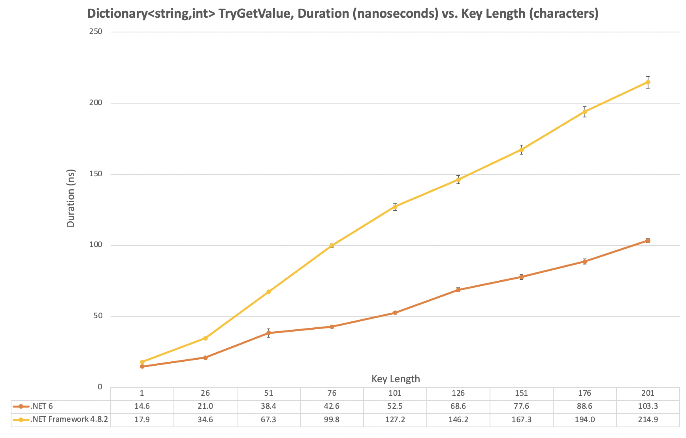
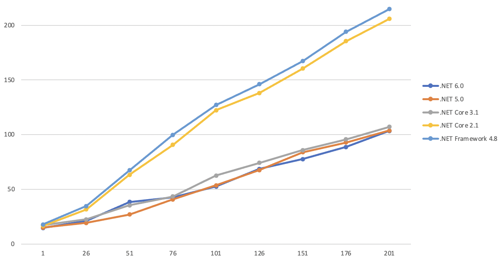

How much faster is it to use a shorter key for a string-keyed dictionary? And how does that vary based on .NET 6.0 vs. .NET Framework 4.8? The [avalanche of performance improvements in the runtime][performance improvements in net6] had me convinced the newer runtime would be faster, but by how much, and what order of magnitude was the impact of key length on performance (nano, micro, or milliseconds)?

We'll start with the results:



## Benchmark Setup

The source code is [on GitHub][benchmark source]. The method I've benchmarked is:

```csharp
public int TryGetValue(string key) => _dictionary.TryGetValue(key, out var value) ? value : default;
```

The benchmark supports running that for keys of various length (I did 1 to 201 in increments of 25) over 5 runtimes, leveraging [BenchmarkDotNet's arguments source].

The `csproj` file to support multiple runtimes looks like this:

```xml
<Project Sdk="Microsoft.NET.Sdk">

  <PropertyGroup>
    <OutputType>Exe</OutputType>
    <TargetFrameworks>net6.0;net5.0;netcoreapp3.1;net48;netcoreapp2.1</TargetFrameworks>
    <LangVersion>7.3</LangVersion>
  </PropertyGroup>

  <ItemGroup>
    <PackageReference Include="BenchmarkDotNet" Version="0.13.1" />
  </ItemGroup>

</Project>

```

## Benchmark Results - All Runtimes



The runtimes cluster into a slow group (.NET Framework 4.8, .NET Core 2.1) and a fast group (.NET Core 3.1, .NET 5.0, .NET 6.0). On the machine I used (and given the benchmark run durations) I'm attributing the deltas between the fast runtimes to noise, as repeated runs would sometimes change the ordering. This isn't surprising as we're talking about a handful of nanoseconds between them in many cases, which is a couple of processor cycles at best.

On the machine I ran the benchmarks on the results show a cost of around 10-15ns at a key length of 1 character, increasing by 1ns/character for the slow group, and 0.5ns/char in the fast group. These are incredibly small numbers (2-4 processor cycles on the CPU I benchmarked on), and they're worth looking at alongside more common [latency numbers]. Using the .NET 6.0 runtime event at a key length of around 200 characters the cost of that lookup is about the same as accessing RAM.

## Takeaways

Outside of code on a very hot path this probably doesn't matter (though if in doubt, benchmark and trace to be sure!). Being thoughtful with key length will improve performance (I've seen examples where namespaces were used to prefix keys for uniqueness - and some namespaces can be _long_). If getting every last drop of performance is essential, storing data in a field/property is going to be faster (a shared dictionary is often something that is convenient to use).

When it comes to field vs. property there [really isn't any difference] (I'd be curious to see if anything differs in .NET 6, but not curious enough to run that benchmark).

[performance improvements in net6]: https://devblogs.microsoft.com/dotnet/performance-improvements-in-net-6/
[benchmark source]: https://github.com/taddison/dotnet-benchmarks/tree/main/DictionaryKeyLookup
[benchmarkdotnet's arguments source]: https://benchmarkdotnet.org/articles/features/parameterization.html#sample-introargumentssource
[latency numbers]: https://colin-scott.github.io/personal_website/research/interactive_latency.html
[really isn't any difference]: https://till.red/b/1/
