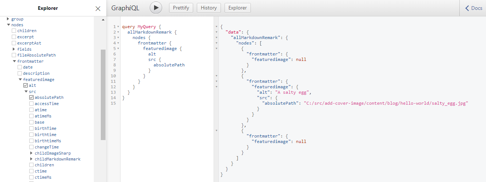
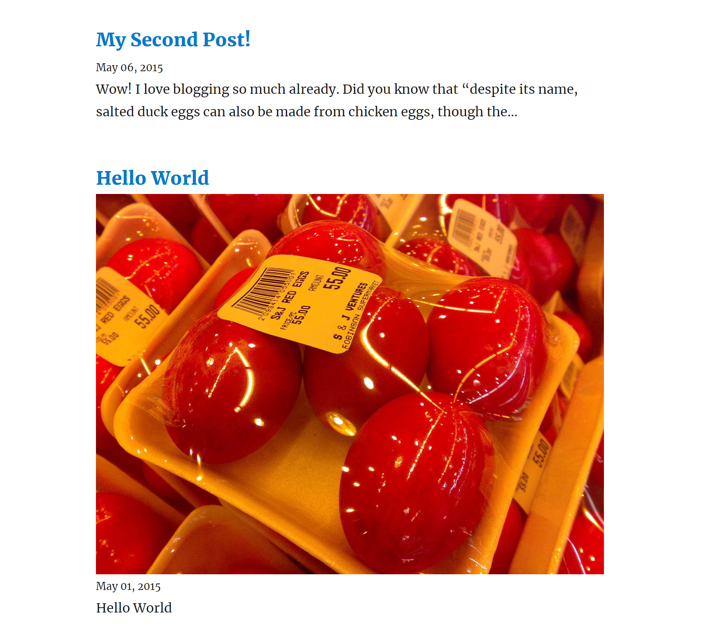

If you decide to use GatsbyJS for your blog I would highly recommend starting with a simple starter and building up. [Gatsby blog starter] introduces a handful of concepts and is substantially easier to understand than some of the more advanced starters. One feature that adds some personality to your site is featured images for your posts - both on the post list and on the post itself. The rest of this article walks through the steps needed to go from the [Gatsby blog starter] to having featured images on the post list and post pages.

## Add the metadata to a post

The first thing to do is update our GraphQL schema, which we do by adding a new property to the blog post frontmatter. To ensure our featured image is also accessible we'll specify some alt text. As an example, we'll add the existing image from the 'Hello World' post as a featured image. You can give the property any name you want - I've used `featuredimage` which contains a `src` and an `alt`.

```
---
title: Hello World
date: "2015-05-01T22:12:03.284Z"
description: "Hello World"
featuredimage:
  src: "./salty_egg.jpg"
  alt: "A salty egg"
---
```

> If you are running `gatsby develop` you need to restart that task, as schema changes (or more broadly any changes that require re-running `gatsby-node.js`) aren't hot-reloadable.

You can verify this has worked by browsing the GraphQL schema at `http://localhost:8000/___graphql` and inspecting the `allMarkdownRemark` nodes - the `frontmatter` should now have a `featuredimage` property. The image below shows that our salty egg post has a featured image, and the other two posts have nothing.



## The GatsbyJS image pipeline

Because our starter has the [gatsby-transformer-sharp] and [gatsby-plugin-sharp] plugins any images that are found during the build process will be replaced by `ImageSharp` nodes. The documentation for [gatsby-plugin-sharp] is worth reviewing, as is the [working with images in Gatsby] guide. If you want the quick version, where we referred to `./salty_egg.png` in our frontmatter, we'll get back an object we can use with [gatsby-image] - and that means:

- Optimized and resized images
- Multiple images generated for different breakpoints
- Generates placeholder images (for [blur-up]/[traced placeholder] effects)

Anywhere you add images to your Gatsby site you'll want to ensure it goes through the appropriate processing to generate the assets needed to use the `Img` component provided by [gatsby-image].

## Adding the image to the post list

The post list is rendered from `src\pages\index.js`, and to add an image to each post we first need to return the image and its alt tag.

We're taking advantage of a [query fragment][gatsby image query fragment] (you can see the [source code for the fragments on GitHub][gatsby image fragment source]), and we're also going to add a few options to limit the maximum size of images that come back:

```graphql
frontmatter {
  date(formatString: "MMMM DD, YYYY")
  title
  description
  featuredimage {
    src {
      childImageSharp {
        fluid(maxWidth: 1024) {
          ...GatsbyImageSharpFluid
        }
      }
    }
    alt
  }
}
```

I'm using `fluid` (which generates images that stretch to fill a fluid container), though we could have also used `fixed`, which is for images that have (unsurprisingly) a fixed width and height. The [gatsby-image] docs are a great place to start if you want to dig into the details.

To get the image on our page we now need to update the markup. First up we need to import `gatsby-image`:

```js
import Img from "gatsby-image"
```

To add the image to each post we first extract the `featuredimage` from our node:

```js
posts.map(({ node }) => {
  const title = node.frontmatter.title || node.fields.slug
  const featuredimage = node.frontmatter.featuredimage
```

And finally render the image if the post has one (in my example I've put it between the title and the post - you'll want to spend a bit of time styling this!):

```js
{
  featuredimage && (
    
  )
}
```

And there we have it, a rather _functional_ looking image on our post list!



Adding the image to the post page requires repeating the same steps in the `\src\templates\blog-post.js` file. Depending on your layout you may want to tweak the settings (max size/height - or maybe you'll want to override the quality and have higher quality images on your post page?).

## Further reading

There is a lot of documentation for images in Gatsby, and it isn't always obvious where to go. I'd suggest working through the following:

- [Working with images in Gatsby article][working with images in gatsby]
- [Gatsby-Image documentation][gatsby-image]
- [Using Gatsby-Image][using-gatsby-image] and [Image Processing][image-processing] for some demos

And then as a next step maybe you'll add share-images to your blog post with this great article from [Julian Garamendy] - [Adding custom Open Graph images to Gatsby starter blog]

[gatsby blog starter]: https://github.com/gatsbyjs/gatsby-starter-blog
[gatsby-transformer-sharp]: https://github.com/gatsbyjs/gatsby/tree/master/packages/gatsby-transformer-sharp
[gatsby-plugin-sharp]: https://github.com/gatsbyjs/gatsby/tree/master/packages/gatsby-plugin-sharp
[gatsby-image]: https://www.gatsbyjs.org/docs/gatsby-image
[working with images in gatsby]: https://www.gatsbyjs.org/docs/working-with-images/
[traced-svg]: https://using-gatsby-image.gatsbyjs.org/traced-svg/
[blur-up]: https://using-gatsby-image.gatsbyjs.org/blur-up/
[traced placeholder]: https://using-gatsby-image.gatsbyjs.org/traced-svg/
[gatsby image query fragment]: https://www.gatsbyjs.org/docs/gatsby-image/#image-query-fragments
[gatsby image fragment source]: https://github.com/gatsbyjs/gatsby/blob/master/packages/gatsby-transformer-sharp/src/fragments.js
[using-gatsby-image]: https://using-gatsby-image.gatsbyjs.org
[image-processing]: https://image-processing.gatsbyjs.org/
[julian garamendy]: https://juliangaramendy.dev/
[adding custom open graph images to gatsby starter blog]: https://juliangaramendy.dev/custom-open-graph-images-in-gatsby-blog/
